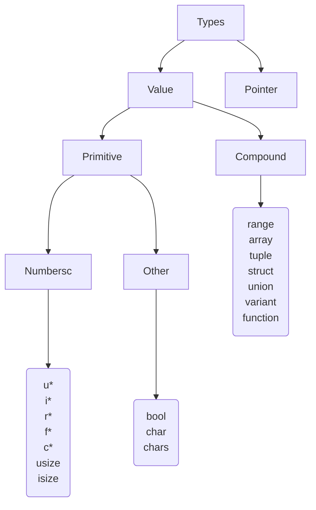

# Nemesis
This is the official documentation for Nemesis programming language.

## Index
1. [Introduction](#introduction)
2. [Surprise mothafuc*a!](#hereiam)
3. [Beauty is variable, ugliness is costant](#variables)
4. [Compile time costants](#compile-time-constant)
5. [Nought endures but mutability](#mutability)
6. [Form ever follows function](#function)
7. [Control flow](#control-flow)
    1. [Block expression](#block-expr)
    2. [If expression](#if-expr)
    3. [Clever selection](#when-expr)
    4. [For multiple purposes](#for-expr)
    5. [Delaying execution](#later-stmt)
8. [Data types](#typesystem)
    1. [Numbers](#numeric)
    2. [Booleans](#boolean)
    3. [Characters](#character)
    4. [Strings](#string)
    5. [Range](#range)
    6. [Array](#array)
    6. [Slice](#slice)
    7. [Tuple](#tuple)
    8. [Struct](#struct)
        1. [A niche aspect... Bitfields](#bitfield)
    9. [Union](#union)
    10. [Variant](#variant)
    11. [Anonymous functions](#anoymous-function)
    13. [Damned pointers](#pointer)
    14. [Type alias](#alias)
    15. [Type extension](#extension)
9. [All hail the object!](#lifetime)
11. [Generics](#generics)
    1. [Generic functions](#generic-function)
    2. [Aggregate types](#generic-type)
    3. [Optional](#optional)
12. [Concept](#concept)
13. [Polymorphism and behaviours](#polymorphism)
14. [Contract](#contract)
15. [Workspace](#workspace)
16. [How to import a library into my workspace?](#use)
17. [How to build my app or library?](#build)
18. [C legacy](#C-ABI)
19. [Comments](#comment)
20. [Debug](#debug)
    1. [Test](#test)
    2. [Crashing](#crash)
21. [Appendix](#appendix)
    1. [Tokens](#tokens)
    2. [Grammar](#grammar)


## Introduction <a name="Introduction"></a>
The Nemesis programming language is statically typed compiled language. The project begun as an hobby to create a minimal language like C which extends the functionalities. The goal is to create an expressive yet powerful language for the programmer. The mai features of the language will be:
+ Relatively high performance system language
+ Simplicity and expressiveness
+ Modularity
+ No null pointer
+ Forced initialization of variables
+ Immutability by defaylt
+ Explicit dynamic memory allocation with no garbage collector
+ Integrated debug through unit testing
+ No multilevel inheritance in favor of simple behavioural model
+ Metaprogramming through generics
+ Object oriented programming
+ Functional programming with lambdas
+ Pattern matching
+ User friendly and assisting compiler
+ External linkage for C code integration
+ Almost universal Unicode support
+ UTF-8 encoding for strings and characters

I took inspiration from existing languages like Rust, Go, Kotlin, C++ e Zig.

## Surprise mothafuc*a! <a name="hereiam"></a>
Where all begins...

<pre><code>start() {
    // prints `Surprise mothafuc*a! 😎`
    println("Surprise mothafuc*a! 😎")
}
</code></pre>

Function `start()` is the entry point and it's invoked automatically while `println()` prints a string one one line. As you can see `start()` returns no value.

## Beauty is variable, ugliness is costant <a name="variables"></a>
Through variables it's possibile to save data during the execution. They're declared with prefix keyword `val`. Following rules are applied.
+ It's forbidden to declare homonymous variable <sup>[1](#1)</sup> inside a nested scope. 
+ It's forbidden to redeclare a variable with a different type.
+ It's forbidden to reference a variable outside its lifetime scope.

<pre><code>// it declares an immutable real varabile
<b>val</b> this_is_10 = 10
// error: variable already defined
<b>val</b> this_is_10: <b>chars</b> = "10"
</code></pre>

A variable declared binds a name to a type and some value. A structured declaration allows to define multiple variables on a single line by unpacking a tuple, static array or structure.

<pre><code>// declared two variables from a tuple
// 'result' has type <b>i32</b>, 'error' has type <b>chars</b>
<b>val</b> result, error = (1, "errore: impossibile accedere")
// or from a static array
// 'result' and 'error_code' both have type <b>i32</b>
<b>val</b> result, error_code = [1, 34] 
</code></pre>

## Compile time costants <a name="compile-time-constant"></a>
When an expression may be evaluated at compile time, then its value can be saved into a `const` constant. Compile time constant value can be
+ literal primitive value, like number, string, character, tuple or array
+ an operation between compile time expressions

<pre><code>// constant
<b>const</b> π = 3.14159
// compile time operation
<b>const</b> EXPR = "literal".length
</code></pre>

Constants are not stored in memory like variables but inlined. Another example is when they're used as generic constants.

## Nought endures but mutability <a name="mutability"></a>
The value associated to a variable may be classified into these categories.

+ **Immutable**: this happens when a variable cannot be reinitialized with a different value nor change its internal state as an object. Immutability involves both the variable and its value.

  <pre><code><b>val</b> person = Person(name: "John Doe", age: 35)
  // error: immutable variable cannot be reinitialized
  person = Person(name: "Sherlock Holmes", age: 40)
  // error: immutable variable cannot change
  person.age++
  </code></pre>

+ **Mutable**: this happends when a variable can be initialized and even change its interval state as an object. It's necessary to make `mutable` explicit.

  <pre><code><b>mutable val</b> person = Person(name: "John Doe", age: 35)
  // you can change its name, or internal state
  person.name = "Guy Fawkes"
  // persone.age now is 36
  person.age++
  </code></pre>

It's important to specify `mutable` for function parameters when they can be changed by the function.

<pre><code><b>type</b> Integer(value: <b>int</b>)

// this is not correct
<b>function</b> increment1(x: *Integer) {
    x.value = x.value + 1 // error: `x` is declared as immutable
}
// now this is correct
<b>function</b> increment2(<b>mutable</b> x: *Integer) {
    x.value = x.value + 1 // correct
}
</code></pre>

Changing internal state of an object means acting on its fields if it's a tuple or structure or elements if it's an array or slice.

<pre><code><b>type</b> Integer(<b>hide</b> value: <b>int</b>)

<b>extend</b> Integer {
    create(value: <b>int</b>) = Integer(value: value)
    // change object i internal state, which is field value
    increment(<b>mutable</b> i: *Integer) {
        i.value = i.value + 1
    }
    // no change, just a clone is returned
    incremented(i: Integer) = Integer(value: <b>int</b>.value + 1)
}
...
<b>val</b> immut = Integer.create(1)
immut.increment() // errore, you cannot call a mutable method on immutable object
<b>mutable val</b> mut = immut.incremented()
mut.increment() // correct, mut.value = 3 now
</code></pre>

> **Note**: Immutability involves both the variable, which may or not be reinitialized, and its value, which may or not change its internal state.

## Form ever follows function <a name="function"></a>
Function are declared with keyword `function`. You can omit `function` when your function doesn't expect any generic parameters.
A function returning an expression may be abbreviated with `=`.

> **Note**: function overloading is forbidden, in order to avoid any ambiguity.

<pre><code>// declaration of a function not returning any value
<b>function</b> print_my_string(s: <b>chars</b>) = println("my string is '{s}')
</code></pre>

You can specify a variable number of parameters with `...`. Those parameters must be specified in last positions. You can iterate over them just like a slice.

<pre><code>// sums its arguments
<b>function</b> accumulate(numbers: ...<b>int</b>) <b>int</b> {
    <b>mutable val</b> sum = 0
    <b>for</b> number <b>in</b> numbers = sum = sum + number
    <b>return</b> sum
}
</code></pre>

Function may take generic parameters. They must be known at compile time. This implies that only types and constants can be generic parameters.

<pre><code>// sorting function on array of unknown type, the array is passed by reference (by default) and modified
<b>function</b>(T) sort(<b>mutable</b> sequence: [T]) {
    <b>mutable val</b> i = 0
    <b>while</b> i < sequence.length {
        <b>mutable val</b> j = i - 1
        <b>val</b> key = sequence[i]
        <b>while</b> j >= 0 && sequence[j] > key {
            sequence[j + 1] = sequence[j]
            j = j - 1
        }
        sequence[j + 1] = key
    }
}


// array of type [<b>int</b> : 4]
<b>mutable val</b> array = [4, -5, 6, 9]
// equivale a sort!(<b>int</b>)(&array)
sort(&array)
// stampa [-5, 4, 6, 9]
println("{array}")
</code></pre>

## Control flow <a name="control-flow"></a>
Nemesis control flow structures are not just statements but also expressions, so they can yield a value.

### Block expression <a name="block-expr"></a>
Block expression is a set of instructions sorrounded by `{}`. When the last statement is an expression, then its value is returned from the block.
<pre><code>// block exprresion
{
    <b>val</b> local = 10
    // println() does not return any value
    println("local has value of {local}")
} // no value is returned here

// block expression returning some value
<b>val</b> result = {
    // the expression evaluates to 65
    1 + 4 ** 3
} // now 'result' is 65
</code></pre>

> **Nota**: each block expression allocates a frame on the stack. The local variables' lifetimes are limited by the enclosing block.

### If expression <a name="if-expr"></a>
`if` block now can return a value. You can chain several `else if` and `else`. Returned value comes from the block associated to the verified condition.

<pre><code>// computes max value
<b>function</b> max(a: <b>int</b>, b: <b>int</b>) <b>int</b> {
    // here <b>return</b> is redundant
    <b>if</b> a > b { a } <b>else</b> { b }
}
</code></pre>

### Clever selection <a name="when-expr"></a>
Block `when` allows selection among multiple values using pattern matching. 

> **Note**: pattern inside branches must be constant time expressions.

Let's see a bunch of different usages.

+ Match our expression againt several values.
  <pre><code>// funzione che resistuisce un intero
  <b>when</b> compute_result() {
      1 => println("Here we have 1!")
      2 | 3 | 4 | 5 | 6 | 7 | 8 | 9 | 10 {
          ...
          println("Here we have something between 2 and 10")
      }
      <b>else</b> => println("Another meaningless value")
  }
  </code></pre>

+ Find out if our expression falls into a numeric range. To exclude last value use `i..f`, otherwise `i..=f`.
  <pre><code>// here the example
  <b>when</b> compute_result() {
      1 => println("Here we have 1!");
      2..=10 {
          ...
          println("Here we have something between 2 and 10")
      }
      <b>else</b> => println("Another meaningless value")
  }
  </code></pre>

+ Unpacking an expression as a tuple, array or structure when nested fields' values match. Really powerful and handy. To ignore a specific field or element use `_`, while `...` can be used to completely ignore all values from the point on into tuple, record o array pattern. 
  <pre><code>// different types of shape
  <b>type</b> Triangle(<b>real</b>, <b>real</b>, <b>real</b>)
  <b>type</b> EquilateralTriangle(<b>real</b>)
  <b>type</b> Quadrilateral(<b>real</b>, <b>real</b>, <b>real</b>, <b>real</b>)
  <b>type</b> Circumference(radius: <b>real</b>)
  <b>type</b> Shape <b>is</b> Triangle | EquilateralTriangle | Quadrilateral | Circumference
  
  <b>extend</b> Shape {
      // this property returns the name of the shape
      .name(shape: Shape) <b>string</b> {
            <b>when</b> shape {
                // triangle whose fields are ignored
                Triangle(...) => "Triangle"<b>s</b>;
                // triangle with middle side equals to 2
                Triangle(_, 2, _) => "Triangle with middle side of 2";
                // `l` variable is inialized from field's value
                EquilateralTriangle(l) => "EquilateralTriangle of side {l}"<b>s</b>
                // quadrilateral whose fields are ignored 
                Quadrilateral(...) => "Quadrilateral"<b>s</b>;
                // variable 'r' is inialized with value from field 'radius'
                Circumference(r) => "Circumference of radius {r}"<b>s</b>;
                // circumference whose radius is in range [10, 20]
                Circumference(10..=20) => "Circumference of special radius 10"<b>s</b>;
            }
      }
  }
  ...
  // shape of type 'Shape'
  <b>val</b> shape = Shape.Circumference(radius: 12.5)
  // prints 'name of shape is Circumference of radius 12.5'
  println("name of shape is {shape.name}")
  // let's make comparisons for an array
  <b>val</b> array = [ 1, 3, -1 ];
  // to select the valid option
  <b>when</b> array {
      [ 1 ] => println("Array with one element equals to 1");
      [ _, 3, _ ] => println("Array with three elements and middle one equals to 3")
  }
  <b>else</b> => println("No match found") 
  // prints 'Array with three elements and middle one equals to 3'
  </code></pre>

Block `when` always evalutes its expression until one matches. It's importanto to add `else` block when you are not covering all possible cases.

### For multiple purposes <a name="for-expr"></a>
You can use `for` block in different cases. Use `break` to exit a loop, or `continue` to continue to next iteration. You can even chain `else` block which is executed when the for stops due to a failed condition and not because of a `break` statement.

> **Nota**: `break` lets you return a value outside the loop, just like `return`.

#### Looping
For loop is like C while and it's executed as long as the condition is satisfied.
<pre><code><b>mutable val</b> j = 0
// linear search, 'index' will hold the index of matching element
<b>val</b> index = <b>for</b> j < array.length {
    // <b>break</b> returns a value outside
    <b>if</b> key == array[j] { <b>break</b> i }
}
// when j == array.length `else` block is executed and -1 is returned
<b>else</b> { -1 }
</code></pre>

When no condition is specified in `for` loop, it is equivalent `for true`.
<pre><code>// stampa un menu all'infinito ed esegue operazioni
<b>for</b> {
    println("Menu: when an option")
    println("[1] execute")
    println("[*] exit")
    ...
}
</code></pre>

#### Iteration
Here you can iterate through a sequence like an array, slice or range.

<pre><code>// range iteration
<b>for</b> i <b>in</b> 0..array.length { ... } <b>else</b> { ... }
</code></pre>

When range indexes are not ordered, then the range is like being empty.

### Delaying execution <a name="later-stmt"></a>
Keyword `later` lets you delay the execution of an expression at the end of the block. It's often useful when releasing resources explicitly.

<pre><code>// dinamycally allocates a sequence
<b>mutable val</b> sequence = allocate!(<b>u8</b>)(100)
// delay its deallocation at the end of the block
<b>later</b> deallocate(sequence)
// will use the resource
...
// the resource is released
</code></pre>

## Data types <a name="typesystem"></a>
Nemesis is a statically typed language with different data types.
+ **Value types**: passed by value and allocated onto the stack.
+ **Reference types**: when data is passed by reference it means that a pointer is shared

Type system is *nominal*, which means that type equivalence is entirely based on declaration names and not on structural equivalence.


### Numbers <a name="numeric"></a>
Numeric types in Nemesis follow mathematical definitions.

| bits | Naturals           | Integers   | Rationals     | Reals            | Complexes             |
|---------------|---------|---------|--------|--------|--------|
| 8             | `u8`    | `i8`    |        |        |        |
| 16            | `u16`   | `i16`   | `r16`  |        |        |
| 32            | `u32`   | `i32`   | `r32`  | `f32`  |        |
| 64            | `u64`   | `i64`   | `r64`  | `f64`  | `c64`  |
| 128           | `u128`  | `i128`  | `r128` | `f128` | `c128` |
| 256           |         |         | `r256` |        | `c256` |
| architettura  | `usize` | `isize` |

Types `isize`, `usize` sizes depend on underlying architecture.

Type `u8` is equivalent to byte. Integers support `%` for division with rest, and power exponentiation with `**`.

You can use these aliases if you prefer.

<pre><code><b>type</b> byte = <b>u8</b>
<b>type</b> natural = <b>u32</b>
<b>type</b> int = <b>i32</b>
<b>type</b> rational = <b>r64</b>
<b>type</b> real = <b>f32</b>
<b>type</b> complex = <b>c64</b>
</code></pre>

`u*`, `i*` e `f*` can be used as suffixes on numeric literals.

<pre><code>// decimal integer 123456
<b>val</b> dec = 123456<b>u64</b>
// binary integer 123456
<b>val</b> bin = 0b0001_11100010_01000000
// hex integer 123456
<b>val</b> hex = 0x1E240
// octal integer 123456
<b>val</b> oct = 0o361100<b>u128</b>
// printd 15241507392
println("{dec + bin * oct}")
// real value
<b>val</b> re = 123<b>f128</b>
</code></pre>

You can instantiate rational number with division `/` between two integers, or explicitly. A rational is a couple of integers accessible through properties `.numerator` and `.denominator`.

<pre><code>// rational 35 / 6
<b>val</b> rat1 = (7 * 5) / 6
// rational 2 / 5
<b>val</b> rat2 = 2 / 5
// result is 187 / 30
<b>val</b> sum = rat1 + rat2
// prints 'numerator = 187, denominator = 30' 
println("numerator = {sum.numerator}, denominator = {sum.denominator}")
// runtime error: division by zero
<b>val</b> inf = <b>rational</b>(sum, 0)
</code></pre>

You can use real number for decimal precision. Suffix `r` may be used on a literal to qualify it as a real.

<pre><code>// it computes the integral of f(x) in (a, b)
<b>function</b> integral(f: <b>function</b>(x: <b>real</b>) <b>real</b>, a: <b>real</b>, b: <b>real</b>) <b>real</b> {
    // `r` suffix for real number
    <b>mutable val</b> area = 0<b>f32</b>
    <b>val</b> n = 10e6
    <b>val</b> dx = (b - a) / n
    <b>mutable val</b> x = a
    <b>while</b> x < b {
        area = area + f(x) * dx
        x = x + dx
    }
    <b>return</b> area
}
</code></pre>

Complex numbers can be created explicitly or with suffix `i` (imaginary unit in math). A complex is just a couple of reals. Properties `.real` e `.imaginary` are available.

<pre><code><b>val</b> a = 10
<b>val</b> b = 11
// prints '10 + 11i'
println("z = {<b>complex</b>(a, b)}")
<b>val</b> z = 11 + 4<b>i</b>
</code></pre>

Here you can see which the rank of conversion are used in ascending order.

`natural < int < rational < real < complex`

Here you can see the outcome result between mathematical operations

+ `- natural -> int` e `natural - natural -> int`, to avoid unintentional overflow
+ `natural / natural  -> rational` e `int / int  -> rational`, to build a rational automatically
+ `int ** int -> rational`, mainly useful for negative exponent
+ `rational ** rational -> complex`, `real ** real -> complex`

Explicit conversion can be made thorugh `as` expression.

<pre><code>// result -2.34 + i
<b>val</b> z = -2.34 + (-1) ** (1 / 2)
// conversion yields -2 
<b>val</b> converted = z <b>as</b> <b>int</b>
</code></pre>

### Booleans <a name="boolean"></a>
Boolean type is `bool` and literal values are `true` e `false`. It covers 8 bits like a byte. It's the same type resulting from comparisons expressions.

### Characters <a name="character"></a>
In Nemesis a character is semantically equivalent to Unicode code point, which is a number in range U+0000-U+10FFFF associated to a bit econding. Type `char` covers 32 bits. A character is initialized with its grapheme or with `\u` escape. Other sequence to initialize a byte escape are `\x`, `\o` or `\b`.

<pre><code>// emoji grapheme
<b>val</b> emoji = '🤮'
// unicode code point for emoji 🤑
<b>val</b> escaped = '\u1f911'
// hexadecimal character '@'
<b>val</b> hex = '\x40'
</code></pre>

### Strings <a name="string"></a>
Nemesis strings are encoded following UTF-8 standard. Strings are allocated onto the stack as primitive literal or dynamically allocated.

#### Primitive string
Primitive string type is `chars` and it stands for a sequence of encoded bytes. Its a **literal** and **immutable** string. The size of a primitive string is statically known. You can iterate through it or access single characters. You can get a slice with notation `str[begin..end]`, which is a reference to a substring. Property `.length` returns the number of characters while `.size` is the number of bytes.
When the access is out of range, then the program crashes.

<pre><code>// primitive string
<b>val</b> str: <b>chars</b> = "This is a plain sequence of bytes"
// iteration
<b>for</b> c <b>in</b> str { println("character is {c}") }
// random access
<b>val</b> c = str[3]
// substring 'plain`
<b>val</b> view: <b>chars</b> = str[10..15]
</code></pre>

> **Nota**: difference between `chars` e `[byte]` consists in the interpretation of the encoding, which is UTF-8 for `chars`. Remember that `chars` is always passed by reference.

#### Stringa
Type `string` is a sequence of bytes allocated on heap memory. It offers the same operations and properties of a primitive string. What's more you can chain strings with `+` operator. You can explicitly mark a string literal with `s` to instantiate a `string` rather than a `chars` sequence.
  
<pre><code>// explicit construction
<b>val</b> str1 = "This looks like "<b>s</b>
// using suffix
<b>val</b> str2 = "a damn 💩!"<b>s</b>
// prints 'Concatenation gives: This looks like a damn 💩!'
println("Concatenation gives: {str1 + str2}")
</code></pre>

> **Nota**: conversion between `string` and `chars` and viceversa is implicit.
> <pre><code>// takes a string as a parameter
> <b>function</b> handle(s: <b>string</b>) { ... }
> ...
> // even though type has type <b>chars</b>, it's automatically converted to <b>string</b>
> handle("This is a literal")
> </code></pre>

#### Interpolazione
The compiler lets you interpolate expressions inside a string using notation `{expr}`. An interpolating string, due to its dynamic nature, has necessarily type `string`.

<pre><code>// euler identity, prints 'e ** (1i) + π = 0'
<b>val</b> interp = "e ** (1i * π) + 1 = {e ** (1i * π) + 1}"
</code></pre>

> **Nota**: scanner translates `"e ** (1i) + π = {e ** (1i) + π}"`
> into primitive `__format("e ** (1i) + π = ?", e ** (1i) + π)`.

### Range <a name="range"></a>
You can even define a custom numeric type which must fall into a predefined range.

<pre><code>// week day ranges in [1, 7]
<b>type</b> WeekDay <b>range</b> 1..=7
// natural number must be positive
<b>type</b> Natural <b>range</b> 0..
// error: -10 not in range `Natural`
<b>val</b> prime: Natural = 10
</code></pre>

A runtime error will occur whenever the range constraint is violated.

### Array <a name="array"></a>
Array type `[T : n]` stands for a sequence of `N` values of type `T` allocated on the stack. Array size must be constant. You can get a slice of the array with notation `array[begin..end]`. Property `.size` returns the count of the elements.

<pre><code>// array [Person : 2]
<b>val</b> people = [Person(name: "Bruce Wayne", age: 35), Person(name: "Oliver Queen", age: 30)]
// iteration
<b>for</b> person <b>in</b> people { println("{person}") }
// error: `people` is declated immutable
people[1].age++
</code></pre>

When an array initializer contains less elements than expected, remaining elements are initialized to the last value.

<pre><code>// array of 16 zeros, which is [0, 0, 0, 0, 0, 0, 0, 0, 0, 0, 0, 0, 0, 0, 0, 0]
<b>val</b> zeros: [<b>int</b> : 16] = [0 : 16]
</code></pre>

Array is passed by reference.

### Slice <a name="slice"></a>
Slice type `[T]` is a reference to a subsequence of an array. Supporta le normali operazioni di un array. It supports property `.size` and notations `ref[i]` or `ref[i..f]`. Slice can only be constructed with operation `array[i..f]`.

<pre><code>// get a substring a prints it
<b>val</b> s = "We're fuc*ed up! 🤡"
// iteration on string, which prints its characters
// prints 'u ~ p ~ ! ~ 🤡 ~ '
<b>for</b> c <b>int</b> s[13..] { print(" {c} ~ ") }
// array
<b>val</b> a = [0, 1, 2, 3, 4, 5, 6, 7, 8, 9]
// slice [2, 3, 4, 5]
<b>val</b> slice = a[2..=5]
</code></pre>

As you can see here a slice of a string has the same type of a primitive string `chars`.

### Tuple <a name="tuple"></a>
Tuple type `(A, B, C, ...)` is a sequence of a fixed number of elements of different types and it's allocated on the stack. You can use notation `.index` to access the single element. Property `.size` returns the count of elements.

<pre><code>// tuple type mau be used to return multiple values from a function
<b>function</b> fun() (<b>int</b>, <b>string</b>) { ... }
...
// unpacking
<b>val</b> result, err = fun()
// tuple type (<b>int</b>, <b>chars</b>, <b>real</b>)
<b>mutable val</b> values = (1, "Hello!", 2.3<b>f32</b>)
// access first value
values.0 = 10
</code></pre>

> **Note**: empty tuple `()` is used to identify the absence of value and its the default return type of functions not returning any value.
<pre><code>// empty tuple type is also called `unit`
<b>type</b> unit = ()
</code></pre>

### Struct <a name="struct"></a>
A structure type is just like a tuple where you access fields by names instead of indices. Keyword `hide` makes fields not visible outside workspace of declaration.

<pre><code>// named structure
<b>type</b> structure(i: int, s: string)
...
// a has type `structure`
<b>val</b> a = structure(i: 10, s: "hello!")
// anonymous structure
<b>val</b> b = (i: 10, s: "hello!")
// b has a type which is structurally equivalent to `structure`
// quindi type(a) != type(b)
</code></pre>

> **Nota**: two tuple or structure type with different declaration are always different, despite their structural equivalence.

A record can be either
+ **tuple**: fields are accessed by index and are always visible.
  <pre><code>// definizione di struttura come tupla
  <b>type</b> Result(<b>int</b>, <b>string</b>)
  // extends Result tuple type
  <b>extend</b> Result {
      // property definition
      .is_error(r: Result) <b>bool</b> = r.0 != 0
  }
  ...
  <b>val</b> result = get_result()
  // property access
  <b>if</b> result.is_error { println("Error has occured: {result.1}") }
  </code></pre>

+ **structure**: fields are accessed by their names and can be hidden with `hide`.
  <pre><code>// named structure definition
  <b>type</b> Employee(name: <b>string</b>, age: <b>usize</b>, balance: <b>real</b>)
  // extension of tyoe Employee with methods
  <b>extend</b> Employee {
      // shared function creating an Employee object
      create(name: <b>string</b>, age: <b>int</b>) Employee = Employee(name: name, age: age, balance: 0.0)
      // property
      .rank(e: Employee) <b>int</b> = e.balance / e.age <b>as</b> <b>int</b>
  }
  ...
  // construction of structure through initialization
  <b>val</b> employee = Employee(name: "Aleksej Stachanov"<b>s</b>, age: 30, balance: 10e3)
  // construction with shared function
  <b>val</b> employee = Employee.create("Mr. Newbie"<b>s</b>, 25)
  // prints 'Mr. Newbie has rank 0'
  println("{employee.name} has rank {employee.rank}")
  </code></pre>

Structures and tuples are always passed by copy.

#### A niche aspect... Bitfields <a name="bitfield"></a>
Bitfields are fields holding integers of custom size.

<pre><code>// disk representation on 32 bits architecture
<b>type</b> DiskRegister(ready: 1, error: 1, spinning: 1, write_protect: 1, head_loaded: 1, err_code: <b>byte</b>, track: 9, sector: 5, command: 5)
</code></pre>

> **Nota**: bitfields are valid just inside tuple, structure or `union`.

### Union <a name="union"></a>
Type `union` is similar to tuple and structure. The main difference is that its fields all share the same space, so any change on one field will affect the memory occupied even by other fields.

<pre><code>// shared memory on 128 bits
<b>type</b> FloatOrBytes <b>union</b>(float: <b>f128</b>, bytes: [0: 16])
...
// union creation
<b>mutable val</b> u = FloatOrBytes(float: 0.0, bytes: [0])
// writes a float value inside the union
u.float = -12.3
// print bytes overwritten
print("bytes: ")
<b>for</b> b <b>in</b> u.bytes {
    print("{b} ")
}
print("\n")
</code></pre>

Like structure and union, union is passed by copy.

### Variant <a name="variant"></a>
Variant type is useful for object that can cover different types during their existance. Internally this is accomplished as a tagged union.

Block `when` is useful for picking the right variant type.

<pre><code>// variant type Token can be Space or Punctuation or Number or Word
<b>type</b> Space
<b>type</b> Punctuation
<b>type</b> Number(<b>i32</b>)
<b>type</b> Word(<b>string</b>)
// Token as variant alias
<b>type</b> Token = Space | Punctuation | Number | Word
...
// creation of a space and then a token
<b>val</b> space = Space()
<b>val</b> tok: Token = Word("text"<b>s</b>)
...
// selection
<b>when</b> tok {
    // as space
    Space => println("Here we have a space")
    // as number whose value is unpacked into `num` variable
    Number(num) => println("Number is {num}")
    // Punctuation e Word cases are not covered
    _ { ... }
}
</code></pre>

So far we have seen anonymous variant. To create a named variant which is not just an alias, you can use keyword `is`.

<pre><code>// Token is now defined as a named variant
<b>type</b> Token <b>is</b> Space | Punctuation | Number | Word
</code></pre>

To test just a single case you can use this shortcut version of `when` block.

<pre><code>// type either
<b>type</b>(T) Left(T)
<b>type</b>(T) Right(T)
// variant alias
<b>type</b>(T) Either = Left(T) | Right(T)
// variable of type `Either(int)`
<b>val</b> v = left(10)
// let's test if `v` has type `Right` o `Left` with destructuring
<b>when</b> v = Right(value) {
    println("v is right and wraps value {value}")
} 
</code></pre>

### Anonymous functions <a name="anoymous-function"></a>
In Nemesis you can treat functions just like variables and pass them as arguments. Anonymous function type `function(A, B) C` is just like a functon but unnamed.

In order to avoid ambiguity let's say what is a *closure* in Nemesis. A *closure* is a block of code capable of capturing the sorrounding context for future usages. Apparently it is declared as an anonymous function, but its type is `lambda(A, B) C` and cannot be compared in any way to anonymous functions. 

<pre><code>// anonymous function `function(int) int`
<b>val</b> callable = <b>function</b>(x: <b>int</b>) <b>int</b> = x * x
// calls it, now res = 100
<b>val</b> res = callable(10)
// closure of type `lambda(*int)`
<b>val</b> closure = <b>function</b>(x: <b>int</b>) <b>int</b> = x * x
</code></pre>

### Damned pointers <a name="pointer"></a>
We all have that love hate relationship with pointers. They implement the logic behind references and their type is `*T`. They support different operations
+ `*ptr` to access the pointed value
+ `ptr[index]` or `ptr[b..e]` together with arithmetic `ptr + offset` or `ptr - offset`, these operations may be dangerous when accessing invalid memory.

Following constraints are applied when using pointers.
+ A pointer must always be initialized and cannot be null.
+ A pointer may refer an object stored in static, dynamic or stack memory.
+ Operator `&` is used to get a pointer from an object.
+ Operator `*` returns pointed value.
+ Referencing and derefering may be an implicit operation (like when passing arguments).

<pre><code>// local variable
<b>mutable val</b> counter = 0
// pointer
<b>mutable val</b> reference = &counter
// change of the variable through its pointer
*reference = 10
// prints `counter = 10`
println("counter = {counter}")
</code></pre>

### Type alias <a name="alias"></a>
Alias name lets you reference a type with a custom name you choose.

<pre><code>// importing workspace
<b>use</b> difficult_names
// we can take advanga of an alias for a long name
<b>type</b> MyNameChoice = difficult_names.BastardVeryLongName
// from now one we can refer 'difficult_names.BastardVeryLongName' as 'MyNameChoice'
</code></pre>

### Type extension <a name="type-extensione"></a>
Block `extend` lets you easily add functionalities to your types. You can add
+ Functions operating the object like `Type.func(obj, arg)` or through oop notation `obj.func(arg)` when first argument is of the same type of the object.
+ Properties, which is like accessing fields, yet they're just plain functions. For example `string.length` is not a field of type `string` but a computed property. You can use notation `.name(t: Type): type {...}` to define them.
+ Constants like `Type.THIS_IS_A_CONSTANT`.
+ Nested ata types, for example `Type.NestedType`.

In this example we extend `u8`.

<pre><code>// block `extend`
<b>extend</b> <b>u8</b> {
    // to refer to the type itself
    <b>type</b> self = u8
    // min and max constants for 8 bit unsigned integer
    <b>const</b> (MIN, MAX): (self, self) = (0, 256)
    // property
    .even(n: self): <b>bool</b> => n % 2 == 0
    // shared function to computed greatest common divisor
    gcd(x: self, y: self) self => <b>if</b> y == 0 { x } <b>else</b> { gcd(y, x % y) }
}
...
<b>val</b> x = 10
<b>val</b> y = <b>u8</b>.MAX
<b>val</b> gcd = x.gcd(y)
// alternatively <b>val</b> gcd = y.gcd(x)
// or <b>val</b> gcd = <b>u8</b>.gcd(x, y)
println("gcd({x}, {y}) = {gcd}"))
// you can access a property as follows
<b>if</b> gcd.even { println("{gcd} is even") }
</code></pre>

## All hail the object! <a name="lifetime"></a>
Lifetime of objects can vary. I may be
+ **Temporary**: this happens when an object is created and it is not stored inside a variable. Their lifetime is limited withing their enclosing block.

  <pre><code>// length of `You make me 🤣` is 13 characters and this has a temporary existence
  <b>val</b> len = "You make me \u1f923".length
  </code></pre>

+ **Automatic**: when its existence depends on its enclosing block. Automatic objects are stored into *local* variables. Local variables' values are stored into the *stack frame*. Each block of `{}` allocates a new stack frame and its relative variables. When the execution of the block terminates, all its content are deallocated. You can use operator `&` to get a reference to the object.

  <pre><code>// mistaken example of how to take a reference of a local variable
  <b>function</b> allocate_person(name: <b>string</b>, age: <b>usize</b>) *Person
    = &Person(name: "John Doe", age: 36) 
    // error: you cannot export the pointer to a local variable outside its scope
  </code></pre>

+ **Dynamic**: these objects' lifetimes are not limited by the enclosing block. They live as long as the programmer deallocates explicitly their memory. Allocation happens into *heap* memory and deallocation must be performed entirely by the programmer.

+ **Static**: these objects live as long as the program runs. Initialization occurs only the first time. Static object live in `data` memory and they're handled by the process itself like automatic variables. You must specify keyword `static` to create a static variable. Nevertheless, its visibility is limited by the enclosing block.

  <pre><code>// static variable into a function
  <b>function</b> increment() {
      // object is initialized to zero only the first time
      <b>static mutable val</b> counter = 0
      println("{counter}")
      // change static variable
      counter = counter + 1
  }
  ...
  // first time 'increment' is invoked, then it prints '0'
  increment()
  // prints '1'
  increment()
  </code></pre>

## Generics <a name="generics"></a>
This mechanism allows you to define types and functions whose construction depends on other types or costants. Let's see.

Generic parameters list must contains compile time expressions, like
+ constant
+ data type

Generic parameter list appears like `(ParamType1, ParamType2, CONSTANT: Type, ecc)`. You can even define constraints with concepts over those generic parameters, like `if Constraint1(ParamType1) | Constraint2(ParamType2, CONSTANT) ecc`.

Let's start with a function which is supposed to print the value of its argument.

<pre><code>// prints an integer
<b>function</b> display_int(i: <b>int</b>) = println("{i}")
// prints a string
<b>function</b> display_string(s: <b>string</b>) = println("{s}")
// prints whatever the f*ck we want (that is printable)
<b>function</b>(T) display(item: T) = println("{item}")
</code></pre>

As you can see generic functions are really handy when we want to accept different types of argument.

### Aggregate types
Aggregate data types like tuple, structures, union or variants may be parameterized through generic arguments. Let's make an example of a dynamic vector of arbitrary element type.

<pre><code>// dynamic vector of generic type
<b>type</b>(T, MIN_SIZE: <b>usize</b>) Vector(<b>hide</b> buffer: *T, <b>hide</b> size: <b>usize</b>)
// extension
<b>extend</b>(T, MIN_SIZE: <b>usize</b>) Vector(T, MIN_SIZE) {
    // shared function
    create() Vector(T, MIN_SIZE) = ...
    // destruction
    destroy() {...}
}
</code></pre>

Complete specialization, which means extending type `Vector(i32, 8)` is allowed, while partial specialization is not allowed. 

### Optional <a name="optional"></a>
Generic variant type `opt` lets you define a variable that may or not hold a value.

<pre><code>// definition of generic type opt
<b>type</b> none
<b>type</b>(T) opt <b>is</b> T | none
</code></pre>

Type `opt` may also be used to represent null pointers. This avoids null dereference.

<pre><code>// definition of binary tree structure
<b>type</b>(T) TreeNode(value: T, left: opt(*T), right: opt(*T))

// extension
<b>extend</b>(T) TreeNode(T) {
    ...
    // property that test if it has left child
    .has_left_child(t: TreeNode(T)) <b>bool</b> {
        <b>when</b> t.left {
             some(_) => <b>true</b>
             none => <b>false</b>
        }
    }
}
</code></pre>

## Concept <a name="concept"></a>
Concepts lets you define compile time contraints over a type. Concepts lets you define a predicate over generic functions and types in order to enable their construction.

<pre><code>// clone concept is defined as follows in core library
<b>concept</b>(T) cloneable {
    clone(self: T) T
}
// sized type must define `size` property
<b>concept</b>(T) sized {
    .size(t: T) <b>usize</b>
}
// numeric concept is used for type defining the following functions
<b>concept</b>(T) numeric {
    add(x: T, y: T) T;
    subtract(x: T, y: T) T;
    .abs(t: T) T;
}
// concept for iterable sequence
<b>concept</b>(T) iterable {
    // generates an iterator explicitly
    <b>function</b>(Iter) walk(sequence: T) Iter; 
}
// concept for iterator
<b>concept</b>(T) iterator {
    // iterates to next element
    <b>function</b>(U) next(mutable iter: *T) U | none;
}
// concept for a printable type which must define `str` function
<b>concept</b>(T) printable {
    str(self: T) string
}
// concept for indexing with `[]` notation
<b>concept</b>(T) indexable {
    <b>function</b>(I, R) at(self: T, index: I) R
}
// concept for destructible object
<b>concept</b>(T) destructible {
    destroy(mutable self: *T)
}
</code></pre>

You can create more complex concept predicates with `&` e `|`. Operator `&` has greater precedence than `|`.

<pre><code>// combination
<b>concept</b>(T) Combination <b>as</b> Numbersc(T) & (Clone(T) | Size(T)) {
    new_function() T
}
</code></pre>

Let's build a test with concepts.

<pre><code>// generic parameters list with constraint
<b>function</b>(T) <b>if</b> Numbersc(T) & Clone(T) accept(t: T) { ... }
...
// this will fail because type `<b>chars</b>` doesn't satisfy previous constraints
accept("string")
</code></pre>

This `if` condition is suitable for building constraints.

<pre><code>// counting sort can be applied only on integral and comparable type as the condition imposes
<b>function</b>(T) <b>if</b> Integral(T) & Compare(T)
counting_sort(<b>mutable</b> sequence: [T]) {
    <b>val</b> min = min(sequence)
    <b>val</b> max = max(sequence)
    <b>mutable val</b> frequency = [0: max - min + 1]
    <b>mutable val</b> output = [0: sequence.size]
    <b>for</b> elem <b>in</b> sequence { ++frequency[elem - min] }
    <b>for</b> i <b>in</b> 1..frequency.size { frequency[i] += frequency[i - 1] }
    <b>mutable val</b> j = sequence.length - 1
    <b>for</b> j >= 0 {
        output[--frequency[sequence[j] - min]] = sequence[j]
        --j
    }
    <b>for</b> i <b>in</b> 0..sequence.size { sequence[i] = output[i] }
}
</code></pre>

All types satisfaying concept `iterator` can be traversed in for range and their iterator must satisfy `iterable` concept.
Types satisfying concept `printable` can be automatically converted to string with format operator `{}`. Types that satisfy `indexable` can be accessed with indexing operator `[]`.

## Polymorphism and behaviours <a name="polymorphism"></a>
In Nemesis you can obtain polymorphic behaviour from a set of types. This means creating a shared behaviour for different types, specialized by each one. Behaviour block `behaviour` lets you define behaviour as function prototypes. It's necessary to take the object argument as pointer to achieve dynamic dispatch.

<pre><code>// shared behaviour on type `Shape`
<b>behaviour</b> Shape {
    // draw a shape
    draw(s: *Shape)
    // compute area as property
    .area(s: *Shape) <b>real</b>
}
</code></pre>

Behaviour block just contains empty prototypes of functions which must be implemented by types called *implementors*.

<pre><code>// data type for rectangle
<b>type</b> Rectangle(base: <b>real</b>, height: <b>real</b>)
// data type for circle
<b>type</b> Circle(radius: <b>real</b>)
// extension of rectangle which makes it an implementor of behaviour `Shape`
<b>extend</b> Rectangle <b>as</b> Shape {
    // draw a rectangle
    draw(r: *Rectangle) = println("This is a rectangle")
    // compute its area
    .area(r: *Rectangle) <b>real</b> = r.base * r.height
}
// extension of circle which makes it an implementor of behaviour `Shape`
<b>extend</b> Circle <b>as</b> Shape {
    // draw a rectangle
    draw(c: *Circle) = println("This is a circle")
    // compute its area
    .area(c: *Circle) <b>real</b> = 3.14 * c.radius ** 2
}
// heterogeneous vector of object implementing Shape behaviour
<b>val</b> shapes: [*Shape] = [ &Rectangle(base: 10, height: 2) as Shape, &Circle(radius: 3) ]
// prints the area in a polymorphic way for each object
// `area is 20`
// `area is 28.3`
<b>for</b> shape <b>in</b> shapes { println("area is {shape.area}") }
</code></pre>

Internally *vtables* are used to accomplish *dynamic dispatch*, which means the resolution of which function needs to be called at runtime.

> **Note**: behaviour prototypes cannot take generic parameters.

## Contract <a name="contract"></a>
In different context it's really useful to detect logic errors by testing conditions. Functions is an example.
+ `require` tests a condition before the execution of a function.
+ `ensure` tests a condition after the execution of a function.
+ `invariant` tests a condition both before and after the execution of a function.

<pre><code>// the algorithm must produce an ordered sequence at the end
<b>function</b>(T) <b>if</b> Compare(T) sort(<b>mutable</b> sequence: [T])
    // test the condition when exiting the function
    <b>ensure</b> sorted(sequence)
{...}
// binary search requires the input sequence to be ordered
<b>function</b>(T) <b>if</b> Compare(T) binary_search(sequence: [T], key: T) <b>isize</b>
    // test the parameter sequence is ordered at the beginning
    <b>require</b> sorted(sequence) 
{...}
</code></pre>

Contract `invariant` is mainly useful in loop bodies.

<pre><code>// tests the condition at the beginning of each cycle
<b>for</b> i < size 
    // condition
    <b>invariant</b> i >= 0
// corpo del ciclo for
{...}
</code></pre>

When a contract condition failes, then program crashes.

> **Nota**: functions called inside contract statements should not mutate data.

## Workspace
A workspace in Nemesis is physically a directory containing source files `.ns` that compose
1. an application, whose entry point is the `start` function defined in one of the source files
2. a library, which is a set of functions, types and other handy declarations

You can initialize a workspace inside your directory as follows
```
$ mkdir workspace
$ cd workspace
$ nemesis init
```
The command will interactively guide you to the creation of your project, which may be either a library or app.

When you want to make the affiliation of a file to a library explicit, then use statement `lib`.
Each `lib` is a single compilation unit.

<pre><code>// file from library 'math'
<b>lib</b> math
// definitions
<b>function</b>(T) sin(x: T) T {}
/* ... */
</code></pre>

When a file has an anonymous workspace, then it is a single compilation unit.

Workspace is a bunch of source files composing a library or application.
When all files are reunited under an `app` then the workspace is treated like an application to execute.
Come è strutturata una workspace?

```
workspace/
    ├─nemesis.manifest
    ├─nemesis.lock
    ├─src/
    │  ├─a.ns
    │  └─b.ns
    ├─cpp/
    │  └─impl.cpp
    └─libs/
       ├─core:1.0.0/
       │   └─...
       └─math:2.0.1/
           └─...
```

Root directory `workspace` contains app or library workspace. Subdirectory `src` contains source files, while `cpp` contains C/C++ sources liked during compilation of the workspace. Directory `libs` contains all dependencies. File `nemesis.manifest` may look like

```
# declaration on current workspace
@library
name 'mylib'
version '1.0.0'
authors [ 'johndoe@gmail.com', 'tommyshelby@gmail.com' ]
# dependencies list
@dependencies
core '2.0.1'
math '1.3.4'
```

and declares the list of dependencies and the workspace as a library. When '@application' replaces `@library`, then the workspaces is treated like an app. File `nemesis.lock` is automatically generated by the compiled and MUST NOT BE TOUCHED. It may look like

```
@library
mylib:1.0.0:<builtin>:<hash>:<path>
@dependencies
core:2.0.1:<builtin>:<hash>:<path>
math:1.3.4:<builtin>:<hash>:<path>
```

which is the output of a post order traversal of the dependency graph. Compilation will follow that orders and sources of current workspace at last.

## How to import a library into my workspace? <a name="use"></a>
If we want to add `math` library to our project, first we need to add its dependency
```
$ nemesis add math
```
When version is not specified, as above, the most stable is used.
```
$ nemesis add math '2.0.1'
```
A dependency is removed with command `remove`, like `add`.

Execution of commands `add` or `remove` changes both `nemesis.manifest` and `nemesis.lock`.

Once installed, you can directly use library `math` in your file after `use` statement. Let's see an example.

<pre><code>// definitions of library 'math' are imported into current workspace
<b>use</b> math
// now we make usage of 'math' functions
println("sin(90) = {math.sin(math.pi / 2)}")
</code></pre>

Declarations prefixed by `hide` keyword from `math` library are not visible outside.

## How to build my app or library? <a name="build"></a>
Once `nemesis.manifest` is written and `nemesis.lock` is generated, you can build your project with a single command
```
$ nemesis build
```
which will generate an executable `application` into the same folder in case of an app, otherwise it will check the correctness of your library sources.
You can directly build and run an application with a single command
```
$ nemesis run
```

## C legacy <a name="C-ABI"></a>
Keyword `extern` help you with external linkage, which means referencing C functions defined elsewhere inside your Nemesis source files. A block `extern` contains a set of function prototypes.

This is an example of a C file linked into the compilation and cointained into `cpp` directory of the workspace.
<pre><code>// file.c
<b>u32_t</b> factorial(<b>u32_t</b> n) { ... }
<b>void</b> handle(<b>void</b> *buf, <b>size_t</b> len) { ... }
</code></pre>

Nemesis file `file.ns` references definitions from files `file.c`.
<pre><code>// file.ns
<b>extern</b> {
    // declaration of <b>uint32_t</b> factorial(<b>uint32_t</b> n) from file.c
    <b>function</b> factorial(n: <b>u32</b>) <b>u32</b>
    // declaration of <b>void</b> handle(<b>void</b> *buf, <b>size_t</b> len)
    <b>function</b> handle(buf: *<b>byte</b>, len: <b>usize</b>) <b>usize</b>
}
</code></pre>

## Comments <a name="comment"></a>
Comments follow the classic syntax
+ `/*` and `*/` for comment on multiple lines
+ `//` for comment on a single line

## Debug <a name="debug"></a>
The following tools are really useful to debug the execution of your program.

### Test <a name="test"></a>
You can launch your program in test mode and executes all `test` blocks. This is mainly useful when you want to test the correctness of a compilation unit.

<pre><code>// testing block
<b>test</b> this_is_my_first_test {
    <b>val</b> tree: BST(<b>i32</b>) = BST!(<b>i32</b>).create()
    tree.insert(10)
    tree.insert(0)
    tree.delete(-1)
}
</code></pre>

You can write tests everywhere you want inside your files and they will be executed in the same order of definition.

The execution of all tests of a workspace happens when you digit
```
$ nemesis test
```

### Crashing <a name="crash"></a>
Primitive function `crash`, like 'abort' in C, is invoked when the program crashes at compilation time. It can be invoked explicitly when you need it. It's also invoked implicitly when something goes wrong during the execution of your program.

<pre><code>// recursive function here is used to create several stack frames
<b>function</b> foo(n: <b>i32</b>) {
    <b>if</b> n == 0 { <b>crash</b>("we have hit the bottom") }
    <b>else</b> { bar(n - 1) }
}
// same here
<b>function</b> bar(n: <b>i32</b>) {
    <b>if</b> n == 0 { <b>crash</b>("we have hit the bottom") }
    <b>else</b> { foo(n - 1) }
}
...
// main thread will fail
foo(10)
</code></pre>

> **Note**: each time a program crashes, its *stack trace* is dumped in order to help the programmer to track down the origin of the failure.

## Appendix <a name="appendix"></a>
The appendix contains the lexicon and grammar definitions of the language.

### Tokens <a name="tokens"></a>
This section defines Unicode ranges for valid identifier names in Nemesis.
<pre><code>Script 	            Description         Unicode ranges

[:script=Arab:] 	Arabic              U+0600–U+06FF U+0750–U+077F U+08A0–U+08FF U+FB50–U+FDFF U+FE70–U+FEFF
[:script=Armn:] 	Armenian            U+0530–U+058F U+FB00–U+FB17
[:script=Beng:] 	Bengali             U+0980–U+09FF
[:script=Bopo:] 	Bopomofo            U+3100–U+312F U+31A0–U+31BF
[:script=Cyrl:] 	Cyrillic            U+0400–U+04FF U+0500–U+052F U+2DE0–U+2DFF U+A640–U+A69F U+1C80–U+1C8F
[:script=Deva:] 	Devanagari          U+0900–U+097F U+A8E0–U+A8FF
[:script=Ethi:] 	Ethiopic            U+1200–U+137F U+1380–U+139F U+2D80–U+2DDF U+AB00–U+AB2F
[:script=Geor:] 	Georgian            U+10A0–U+10FF U+2D00–U+2D2F U+1C90–U+1CBF
[:script=Grek:] 	Greek               U+0370–U+03FF U+1F00–U+1FFF
[:script=Gujr:] 	Gujarati            U+0A80–U+0AFF
[:script=Guru:] 	Gurmukhi            U+0A00–U+0A7F
[:script=Hani:] 	Han                 U+4E00-U+9FCC U+3400-U+4DB5 U+20000-U+2A6D6  U+2A700-U+2B734  U+2B740-U+2B81D
[:script=Hang:] 	Hangul              U+AC00–U+D7AF U+1100–U+11FF U+3130–U+318F U+A960–U+A97F U+D7B0–U+D7FF
[:script=Hebr:] 	Hebrew              U+0590-U+05FF U+FB1D-U+FB4F
[:script=Hira:] 	Hiragana            U+3040–U+309F U+1B000–U+1B0FF U+1B100–U+1B12F U+1B130–U+1B16F
[:script=Knda:] 	Kannada             U+0C80–U+0CFF
[:script=Kana:] 	Katakana            U+30A0–U+30FF U+31F0–U+31FF U+3200–U+32FF U+FF00–U+FFEF U+1B000–U+1B0FF U+1B130–U+1B16F
[:script=Khmr:] 	Khmer               U+1780–U+17FF
[:script=Laoo:] 	Lao                 U+0E80–U+0EFF
[:script=Latn:] 	Latin               U+0000–U+007F U+0080–U+00FF U+0100–U+017F U+0180–U+024F U+0250–U+02AF U+02B0–U+02FF U+1D00–U+1D7F U+1D80–U+1DBF U+1E00–U+1EFF U+2070–U+209F U+2100–U+214F U+2C60–U+2C7F U+A720–U+A7FF U+AB30–U+AB6F 
[:script=Mlym:] 	Malayalam           U+0D00–U+0D7F
[:script=Mymr:] 	Myanmar             U+1000–U+109F U+AA60–U+AA7F U+A9E0–U+A9FF
[:script=Orya:] 	Oriya               U+0B00–U+0B7F
[:script=Sinh:] 	Sinhala             U+0D80–U+0DFF
[:script=Taml:] 	Tamil               U+0B80–U+0BFF U+11FC0–U+11FFF
[:script=Telu:] 	Telugu              U+0C00–U+0C7F
[:script=Thaa:] 	Thaana              U+0780–U+07BF
[:script=Thai:] 	Thai                U+0E00–U+0E7F
[:script=Tibt:] 	Tibetan             U+0F00–U+0FFF
</code></pre>
Here you can find the different token types. From `Latin` script only letters, digits and the underscore are valid inside identifiers.

<pre><code>underscore      : <b>_</b> 

digit			: <b>0</b>..<b>9</b>

hex-digit		: digit | <b>a</b>..<b>f</b> | <b>A</b>..<b>F</b>

bin-digit		: <b>0</b> | <b>1</b>

oct-digit       : <b>0</b>..<b>7</b>

unicode-identifier-start : unicode-character | underscore

unicode-identifier-part : unicode-identifier-start | digit

newline         : U+000A | 0x000D

whitespace      : U+0009 (tab)
                | U+000A (new line)
                | U+000B (vertical tab)
                | U+000C (form feed)
                | U+000D (carriage return)
                | U+0020 (space)
                | U+0085 (next line)
                | U+200E (left-to-right mark)
                | U+200F (right-to-left mark)
                | U+2028 (line separator)
                | U+2029 (paragraph separator)


identifier      : unicode-identifier-start unicode-identifier-part*

interpolated-string-literal  : <b>{</b> expr <b>}</b>

oct-escape        : <b>\o</b> oct-digit{1, 3}

hex-escape        : <b>\x</b> hex-digit{1, 2}

bin-escape        : <b>\b</b> bin-digit{1, 8}

byte-escape       : oct-escape | hex-escape | bin-escape

unicode-escape    : <b>\u</b> hex-digit{1, 6}

escape	          : <b>\</b> ( <b>a</b> | <b>f</b> | <b>n</b> | <b>f</b> | <b>t</b> | <b>v</b> | <b>"</b> | <b>'</b> | <b>\</b> | <b>0</b> ) 
                    | unicode-escape 
                    | byte-escape

char-literal    : <b>'</b> ( [^newline] | escape ) <b>'</b>

string-suffix : <b>s</b>

string-literal*	: <b>"</b> ( [^newline] | escape | interpolated-string-literal )*  <b>"</b> string-suffix?

int-suffix : <b>u8</b> | <b>u16</b> | <b>u32</b> | <b>u64</b> | <b>u128</b> | <b>usize</b>
                   | <b>i8</b> | <b>i16</b> | <b>i32</b> | <b>i64</b> | <b>i128</b> | <b>isize</b>

int-literal : digit ( digit | underscore )*
            | <b>0x</b> hex-digit ( hex-digit | underscore )*
            | <b>0b</b> bin-digit ( bin-digit | underscore )*
            | <b>0o</b> oct-digit ( oct-digit | underscore )*
            int-suffix?

real-suffix : <b>f32</b> | <b>f64</b> | <b>f128</b>


real-literal	: digit ( digit | underscore )* ( <b>.</b> digit ( digit | underscore )* )? ( ( <b>E</b> | <b>e</b> ) ( <b>+</b> | <b>-</b> )? digit+ )? real-suffix?

imag-literal	: digit ( digit | underscore )* ( <b>.</b> digit ( digit | underscore )* )? ( ( <b>E</b> | <b>e</b> ) ( <b>+</b> | <b>-</b> )? digit+ )? <b>i</b>

line-coment     : <b>//</b> any unicode value newline

multi-line-comment : <b>/*</b> multi-line-comment | any unicode value <b>*/</b>

comment         : line-comment | multi-line-comment

keywords        : <b>app</b>
                | <b>as</b>
                | <b>behaviour</b> 
                | <b>break</b>
                | <b>concept</b>
                | <b>const</b>
                | <b>continue</b>
                | <b>else</b>
                | <b>ensure</b>
                | <b>extend</b>
                | <b>extern</b>
                | <b>false</b>
                | <b>for</b>
                | <b>function</b>
                | <b>hide</b>
                | <b>if</b>
                | <b>in</b>
                | <b>invariant</b>
                | <b>is</b>
                | <b>mutable</b>
                | <b>later</b>
                | <b>lib</b>
                | <b>range</b>
                | <b>require</b>
                | <b>return</b>
                | <b>when</b>
                | <b>static</b>
                | <b>test</b>
                | <b>true</b>
                | <b>type</b>
                | <b>union</b>
                | <b>use</b> 
                | <b>val</b>
</code></pre>

### Grammar <a name="grammar"></a>
This section contains the grammar of the language.
<pre><code>literal-expr : int-literal 
             | real-literal
             | imag-literal 
             | char-literal 
             | string-literal
             | bool-literal

primary-expr : literal-expr
             | identifier-expr
             | <b>(</b> expr <b>)</b>
             | tuple-expr
             | record-expr
             | array-expr
             | function-expr

postfix-expr : primary-expr
             ( array-subscript-expr
             | tuple-subscript-expr
             | call-expr
             | record-expr
             | member-expr
             | <b>++</b> 
             | <b>--</b>
             )*

identifier-expr : identifier ( <b>!</b> generic-clause )?

array-expr : <b>[</b> expr ( <b>,</b> expr )* | expr <b>:</b> expr <b>]</b>

tuple-expr : <b>(</b> expr ( <b>,</b> expr )* <b>,</b>? <b>)</b>

function-expr : <b>function</b> <b>(</b> parameter-list? <b>)</b> type? ( block-expr | <b>=</b> expr )

member-expr : <b>.</b> identifier-expr

call-expr : <b>(</b> arguments? <b>)</b>

record-expr : <b>(</b> identifier : expr ( <b>,</b> identifier : expr )* <b>)</b>

arguments : expr ( <b>,</b> expr )*

array-subscript-expr : <b>[</b> expr <b>]</b>

tuple-subscript-expr : <b>.</b> int-literal

unary-expr : ( <b>+</b> | <b>-</b> | <b>~</b> | <b>!</b> | <b>++</b> | <b>--</b> ) unary-expr 
           | reference-expr
           | dereference-expr
           | postfix-expr

reference-expr : <b>&</b> unary-expr

dereference-expr : <b>*</b> unary-expr

conversion-expression : unary-expr ( <b>as</b> type )*

power-expr : conversion-expr ( <b>**</b> conversion-expr )*

multiplicative-expr : power-expr ( <b>*</b> power-expr )*
                    | power-expr ( <b>/</b> power-expr )*
                    | power-expr ( <b>%</b> power-expr )*

additive-expr : multiplicative-expr ( <b>-</b> multiplicative-expr )*
              | multiplicative-expr ( <b>+</b> multiplicative-expr )*

shift-expr : additive-expr ( <b>>></b> additive-expr )*
           | additive-expr ( <b><<</b> additive-expr )*

and-expr : shift-expr ( <b>&</b> shift-expr )*

xor-expr : and-expr ( <b>^</b> and-expr )*

or-expr : xor-expr ( <b>|</b> xor-expr )*

range-expr : or-expr? <b>..</b> or-expr? | or-expr? <b>..=</b> or-expr

comparison-expr : range-expr ( <b><</b> range-expr )
                | range-expr ( <b>></b> range-expr )
                | range-expr ( <b><=</b> range-expr )
                | range-expr ( <b>>=</b> range-expr )

equality-expr : comparison-expr ( <b>==</b> comparison-expr )
              | comparison-expr ( <b>!=</b> comparison-expr )

logic-and-expr : equality-expr ( <b>&&</b> logic-and-expr )*

logic-or-expr : logic-and-expr ( <b>||</b> logic-and-expr )*

expr : if-expr
     | for-expr
     | when-expr
     | block-expr

block-expr : <b>{</b> stmt* <b>}</b>

condition-expr : logic-or-expr

if-expr : <b>if</b> condition-expr block-expr ( <b>else</b> ( if-expr | when-expr | block-expr ) )?

for-expr : ( <b>for</b> identifier ( <b>:</b> type ) <b>in</b> condition-expr )
           contract-clause? block-expr ( <b>else</b> ( if-expr | when-expr | block-expr ) )?

when-expr : <b>when</b> condition-expr <b>{</b> when-branch* <b>}</b> ( <b>else</b> ( if-expr | when-expr | block-expr ) )?
          | <b>when</b> condition-expr <b>is</b> type block-expr
          | <b>when</b> condition-expr <b>=</b> pattern-primary-expr block-expr

when-branch : pattern-expr <b>=></b> expr <b>,</b>?

pattern-expr : <b>is</b> type | pattern-or-expr

pattern-or-expr : pattern-primary-expr ( <b>|</b> pattern-primary-expr )*

pattern-primary-expr : literal-expr
                     | <b>_</b>
                     | <b>...</b>
                     | pattern-path-expr
                     | pattern-range-expr
                     | pattern-tuple-expr
                     | pattern-array-expr
                     | pattern-record-expr

pattern-path-expr : identifier-expr ( <b>.</b> identifier-expr )*

pattern-range-bound-expr : literal-expr | member

pattern-range-expr : pattern-range-bound-expr? <b>..</b> pattern-range-bound-expr? | pattern-range-bound-expr? <b>..=</b> pattern-range-bound-expr

pattern-tuple-expr : <b>(</b> pattern-primary-expr ( <b>,</b> pattern-primary-expr )* <b>,</b>? <b>)</b>

pattern-array-expr : <b>[</b> pattern-primary-expr ( <b>,</b> pattern-primary-expr )* <b>,</b>? <b>]</b>

pattern-record-expr : identifier-expr ( <b>.</b> identifier-expr )* <b>(</b> pattern-primary-expr ( <b>,</b> pattern-primary-expr )* <b>)</b>

pattern-labeled-record-expr : identifier-expr ( <b>.</b> identifier-expr )* <b>(</b> identifier <b>:</b> pattern-primary-expr ( <b>,</b> identifier <b>:</b> pattern-primary-expr )* <b>)</b>

test-block-stmt : <b>test</b> identifier block-expr

continue-stmt : <b>continue</b>

break-stmt : <b>break</b> expr?

return-stmt : <b>return</b> expr?

later-stmt : <b>later</b> expr

assignment-stmt : expr <b>=</b> expr
                | expr <b>**=</b> expr
                | expr <b>*=</b> expr
                | expr <b>/=</b> expr
                | expr <b>%=</b> expr
                | expr <b>+=</b> expr
                | expr <b>-=</b> expr
                | expr <b><<=</b> expr
                | expr <b>>>=</b> expr
                | expr <b>&=</b> expr
                | expr <b>|=</b> expr
                | expr <b>^=</b> expr

expr-stmt : if-expr
          | for-expr
          | when-expr
          | block-expr

stmt : 
     ( function-declaration
     | type-declaration
     | extend-declaration
     | behaviour-declaration
     | extern-declaration
     | const-declaration
     | var-declaration
     | use-declaration
     | test-declaration 
     | break-stmt
     | continue-stmt
     | return-stmt
     | assignment-stmt 
     | expr-stmt
     | later-stmt
     ) <b>;</b>?

type : single-type ( <b>|</b> single-type )*

single-type : bitfield-type | path-type | record-type | array-type | tuple-type | pointer-type | function-type

path-type : identifier generic-clause? ( <b>.</b> identifier generic-clause? )*

generic-argument : type | constant-expr

generic-clause : <b>(</b> generic-argument ( <b>,</b> generic-argument )* <b>)</b>

path : identifier ( <b>.</b> identifier )*

identifier-type : path generic-clause?

record-type : <b>(</b> fields? <b>)</b>

array-type : <b>[</b> type ( <b>:</b> constant-expr )? <b>]</b>

tuple-type : <b>(</b> type ( <b>,</b> type )* <b>)</b>

pointer-type : <b>*</b> single-type

function-type : <b>function</b> <b>(</b> parameter-types? <b>)</b> type?

bitfield-type : int-literal

parameter-types : <b>mutable</b>? type ( <b>,</b> <b>mutable</b>? type )*

lifetime-specifier : <b>static</b>

var-declaration : lifetime-specifier? <b>mutable</b>? <b>val</b> 
                  ( identifier
                  | identifier ( <b>,</b> identifier )* )
                  ( <b>:</b> type )?
                  <b>=</b> expr

const-declaration : <b>const</b> ( identifier
                  | identifier ( <b>,</b> identifier )* )
                  ( <b>:</b> type )? 
                  <b>=</b> expr

contract-stmt : ( <b>require</b> | <b>ensure</b> | <b>invariant</b> ) expr

contract-clause : ( contract-stmt <b>,</b>? )*

function-prototype : ( <b>function</b> generic-parameter-list? )? identifier <b>(</b> parameter-list? <b>)</b> type? contract-clause?

function-declaration : function-prototype ( block-expr | <b>=</b> expr )

property-prototype : <b>.</b> identifier <b>(</b> parameter-list? <b>)</b> type? contract-clause?

property-declaration : property-prototype ( block-expr | <b>=</b> expr )

generic-parameter-list : <b>(</b> generic-parameter ( <b>,</b> generic-parameter )* <b>)</b> constraint-clause?

generic-parameter : generic-type-parameter | generic-constant-parameter

generic-type-parameter : identifier

generic-constant-parameter : identifier <b>:</b> type

constraint-clause : <b>if</b> constraint-or-expr

constraint-or-expr : constraint-and-expr ( <b>|</b> constraint-and-expr )*

constraint-and-expr : constraint-primary-expr ( <b>&</b> constraint-primary-expr )*

constraint-primary-expr : identifier-type | <b>(</b> constraint-or-expr </b>)</b>

parameter-list : parameter ( <b>,</b> parameter )*

parameter : <b>mutable</b>? <b>...</b>? identifier <b>:</b> type

extend-declaration : <b>extend</b> generic-parameter-list?  identifier-type 
                     ( <b>as</b> identifier-type ( <b>,</b> identifier-type )* )? 
                     ( <b>{</b> ( <b>hide</b>? extend-member-declaration )* <b>}</b> )?

extend-member-declaration : identifier <b>(</b> parameter-list? <b>)</b> type? block-expr
                          | function-declaration
                          | property-declaration
                          | const-declaration
                          | <b>type</b> identifier <b>=</b> type

concept-declaration : <b>concept</b> generic-parameter-list? identifier ( <b>as</b> constraint-or-expr )? <b>{</b> concept-member-declaration+ <b>}</b>?

concept-member-declaration : function-declaration
                           | property-declaration
                           | function-prototype
                           | property-prototype

behaviour-declaration : <b>behaviour</b> generic-parameter-list? identifier <b>{</b> behaviour-member-declaration+ <b>}</b>

behaviour-member-declaration : function-declaration
                             | property-declaration
                             | function-prototype
                             | property-prototype

type-declaration : <b>type</b> generic-parameter-list? identifier 
                 ( record-declaration
                 | variant-declaration
                 | range-declaration
                 | <b>=</b> type
                 )?

range-declaration : <b>range</b> ( literal-expr? <b>..</b> literal-expr? | literal-expr? <b>..=</b> literal-expr )

record-declaration : <b>union</b>? <b>(</b> fields? <b>)</b>

fields : field ( ',' field )*

field : ( <b>hide</b>? identifier <b>:</b> )? type

variant-declaration : <b>is</b> type

extern-declaration : <b>extern</b> <b>{</b> ( <b>hide</b>? function-declaration )+ <b>}</b>

global-declaration : <b>hide</b>?
                     ( function-declaration
                     | type-declaration
                     | extend-declaration
                     | behaviour-declaration
                     | extern-declaration
                     | const-declaration
                     | var-declaration
                     | use-declaration
                     | test-declaration
                     ) <b>;</b>?


use-declaration : <b>use</b> identifier

lib-declaration : <b>lib</b> identifier

app-declaration : <b>app</b> identifier

source-declaration : ( lib-declaration | app-declaration) ? global-declaration*
</code></pre>
---

<b id="1">[1]</b> This phenomenon, called *variable shadowing*, is by default disabled in Nemesis to avoid any case of ambiguity for the porgrammer. [↩](#1)