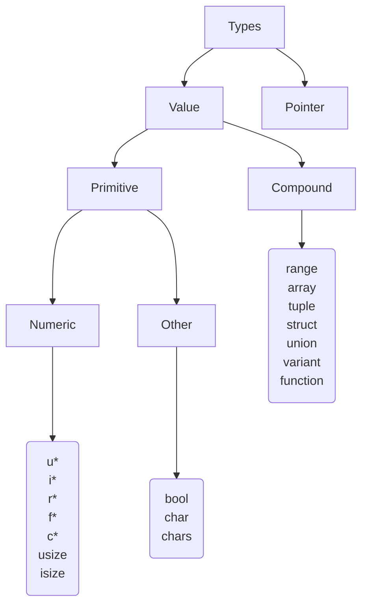

# Nemesis
La documentazione ufficiale del linguaggio Nemesis.

## Indice
1. [Introduzione](#introduzione)
2. [Surprise mothafuc*a!](#hereiam)
3. [Beauty is variable, ugliness is costant](#variables)
4. [Costanti note a tempo di compilazione](#compile-time-constant)
5. [Nought endures but mutability](#mutability)
6. [Form ever follows function](#function)
7. [Flussi di controllo](#control-flow)
    1. [Blocco di codice](#block-expr)
    2. [If come un'espressione](#if-expr)
    3. [Selezione intelligente](#when-expr)
    4. [Quando il for è multiuso](#for-expr)
    5. [Ritardare l'esecuzione](#later-stmt)
8. [Tipi di dato](#typesystem)
    1. [Numeri](#numeric)
    2. [Booleani](#boolean)
    3. [Caratteri](#character)
    4. [Stringhe](#string)
    5. [Range](#range)
    6. [Array](#array)
    6. [Slice](#slice)
    7. [Tuple](#tuple)
    8. [Struct](#struct)
        1. [Un caso particolare... I bitfields](#bitfield)
    9. [Union](#union)
    10. [Variant](#variant)
    11. [Funzioni anonime](#anoymous-function)
    13. [Maledetti puntatori](#pointer)
    14. [Type alias](#alias)
    15. [Type extension](#extension)
9. [Lunga vita agli oggetti!](#lifetime)
11. [Tipi generici](#generics)
    1. [Nelle funzioni](#generic-function)
    2. [Nei tipi aggregati](#generic-type)
    3. [Optional](#optional)
12. [Concept](#concept)
13. [Polimorfismo e comportamenti](#polymorphism)
14. [Contract](#contract)
15. [Workspace](#workspace)
16. [Come importare una libreria nel workspace?](#use)
17. [Fare la build della mia app o libreria](#build)
18. [Senza dimenticare il C](#C-ABI)
19. [Commenti](#comment)
20. [Debug](#debug)
    1. [Test](#test)
    2. [Crashing](#crash)
    3. [Watchpoints-TODO](#watchpoints)
21. [Checkpoint e resurrezione-TODO](#checkpoints)
22. [Appendice](#appendix)
    1. [Lessico](#tokens)
    2. [Grammatica](#grammar)


## Introduzione <a name="introduzione"></a>
Il linguaggio di programmazione Nemesis è un linguaggio compilato con sistema a tipizzazione statica. Il progetto nasce come un hobby per creare un linguaggio simile al C in fatto di performance che estenda le funzionalità. L'obiettivo è di creare un linguaggio che dia completo controllo al programmatore. Le principali caratteristiche del linguaggio saranno:
+ Liguaggio di sistema ad alta performance
+ Semplicità
+ Modularità
+ Assenza di puntatore nullo
+ Obbligo di inizializzazione di variabili
+ Oggetti immutabili di default
+ Allocazione dinamica esplicita
+ Gestione della memoria dinamica senza garbage collection
+ Sistema di debug integrato con test, watchpoints
+ Sistema di risurrezione del programma mediante checkpoints
+ Assenza di ereditarietà in favore dei comportamenti condivisi
+ Meta-programmazione con tipi generici
+ Programmazione ad oggetti con tipi aggregati
+ Programmazione funzionale con funzioni anonime
+ Compilazione assistita user-friendly
+ Integrazione di codice C attraverso external linkage
+ Supporto Unicode in diverse lingue
+ Codifica UTF-8 di stringhe e caratteri

Grande ispirazione è tratta dai linguaggi Rust, Go, Kotlin, C++ e Zig.

## Surprise mothafuc*a! <a name="hereiam"></a>
Iniziamo con il classico saluto

<pre><code>start() {
    // stampa sullo schermo `Surprise mothafuc*a! 😎`
    println("Surprise mothafuc*a! 😎")
}
</code></pre>

La funzione `start()` è il punto di inizio dell'esecuzione e viene invocata in automatico mentre la funzione `println()` stampa una stringa sullo schermo e va a capo. Si noti che la definizione di `start()` implica che questa non restituisca alcun valore.

## Beauty is variable, ugliness is costant <a name="variables"></a>
Le variabili sono fondamentali per salvare i dati all'interno di un programma a tempo di esecuzione. Si dichiarano con il prefisso `val`. Valgono le seguenti regole.
+ Non è ammesso dichiare una variabile omonima <sup>[1](#1)</sup> di un'altra in uno scope annidato. 
+ Non è ammesso redichiarare una variabile attraverso una nuova associazione.
+ Non è possibile riferirsi ad una variabile al di fuori del suo campo di esistenza.

<pre><code>// dichiara una variabile reale immutabile
<b>val</b> this_is_10 = 10
// errore: non è consentito creare una nuova associazione 
<b>val</b> this_is_10: <b>chars</b> = "10"
</code></pre>

Una dichiarazione di variabile è un'associazione di un nome ad un valore e tipo. Un'associazione strutturata permette di creare più variabili insieme da una tupla, un array la cui dimensione è nota a tempo di compilazione, una struttura o union.

<pre><code>// crea le due variabili immutabili da una tupla
// 'result' ha tipo <b>int</b>, 'error' ha tipo <b>chars</b>
<b>val</b> result, error = (1, "errore: impossibile accedere")
// oppure da un array noto a tempo di compilazione
// 'result' e 'error_code' condividono il tipo <b>int</b>
<b>val</b> result, error_code = [1, 34] 
</code></pre>

## Costanti note a tempo di compilazione <a name="compile-time-constant"></a>
Quando un'espressione assume un valore costante, ovvero calcolato a tempo di compilazione, allora può essere salvato come `const`. Un costante a tempo di compilazione può essere
+ un dato primitivo letterale
+ un'operazione fra costanti a tempo di compilazione

<pre><code>// costante nota
<b>const</b> π = 3.14159
// espressione eseguita su letterale a tempo di compilazione
<b>const</b> EXPR = "literal".length
</code></pre>

Le costanti a tempo di compilazione non vengono allocate in memoria ma inserite inline dove utilizzate. Un esempio di utilizzo è nei parametri generici che devono essere noti a tempo di compilazione.

## Nought endures but mutability <a name="mutability"></a>
Una variabile e l'oggetto associato possono ricadere in due definizioni.

+ **Immutabile**: si ha quando una variabile non cambia contenuto e quando il contenuto non muta il proprio stato interno. Ciò implica che una variabile non possa essere reinizializzata e il corrispettivo oggetto contenuto non possa subire modifiche interne. Quindi il concetto si estende sia al contenitore che al contenuto.

  <pre><code><b>val</b> person = Person(name: "John Doe", age: 35)
  // errore: la variabile è dichiarata come immutabile
  person = Person(name: "Sherlock Holmes", age: 40)
  // errore: l'oggetto è dichiarato come immutabile
  person.age++
  </code></pre>

+ **Mutabile**: accade quando un oggetto può mutare il proprio stato interno o valore. Esplicitare lo stato mutabile attraverso `mutable` è utile per enfatizzare le relazioni che altri utilizzatori dell'oggetto hanno con esso. La variabile può essere reinizializzata quando dichiarata mutabile. Anche qui il concetto si estende sia sulla variabile che sul contenuto.

  <pre><code><b>mutable val</b> person = Person(name: "John Doe", age: 35 )
  // il nome è stato cambiato
  person.name = "Guy Fawkes"
  // persone.age diventa 36
  person.age++
  </code></pre>

É necessario esplicitare la mutabilità per i parametri di una funzione quando la funzione ha la possibilità di modificare i parametri.

<pre><code><b>type</b> Integer(value: <b>int</b>)

// versione errata
<b>function</b> increment1(x: *Integer) {
    x.value = x.value + 1 // errore: modifica di parametro `x` dichiarato come immutabile
}
// versione corretta
<b>function</b> increment2(<b>mutable</b> x: *Integer) {
    x.value = x.value + 1 // corretto, x è riferimento a valore mutabile
}
</code></pre>

Per quanto riguarda i campi di un aggregato questi restano mutabili poichè la mutabilità è espressa attraverso il comportamento di un tipo. Quello che conta non è tanto ciò che cambia internamente ma quello che cambia appartemente dalla prospettiva esterna.

<pre><code><b>type</b> Integer(<b>hide</b> value: <b>int</b>)

<b>extend</b> Integer {
    create(value: <b>int</b>) = Integer(value: value)
    // cambia lo stato interno dalla prospettiva esteriore
    increment(<b>mutable</b> i: *Integer) {
        i.value = i.value + 1
    }
    // non cambia nulla ma restituisce un clone incrementato
    incremented(i: Integer) = Integer(value: <b>int</b>.value + 1)
}
...
<b>val</b> immut = Integer.create(1)
immut.increment() // errore, tentativo di chiamare metodo mutante su variabile immutabile
<b>mutable val</b> mut = immut.incremented()
mut.increment() // corretto, mut.value = 3 ora
</code></pre>

> **Nota**: il concetto di mutabilità, e quindi di immutabilità, è proprio sia del contenitore, la variabile, che del suo contenuto, l'oggetto. Infine la mutabilità è annotata sui parametri di funzioni e variabili locali per enfatizzare il concetto di cambiamento dalla prospettiva esteriore.

## Form ever follows function <a name="function"></a>
Le funzione si dichiarano con la parola chiave `function`. Quando non si devono specificare parametri generici è possibile omettere la parola chiave `function`.
Quando il corpo della funzione consiste in una sola
istruzione si può utilizzare la notazione `=` per ritornare il valore o eseguire il comando. Quando una funzione non ritorna valore allora non si deve specificare il tipo di ritorno.

> **Nota**: non è consentito l'overloading di funzioni per evitare ambiguità.

<pre><code>// dichiarazione di una funzione che stampa una stringa letterale e non ritorna valore
<b>function</b> print_my_string(s: <b>chars</b>) = println("my string is '{s}')
</code></pre>

Una funzione può anche avere un numero variabile di argomenti attraverso la notazione `...`. In tal caso il compilatore genera staticamente la definizione con il giusto numero di parametri. I parametri variabili devono essere necessariamente in ultima posizione. Per ottenere i singoli argomenti è possibile iterare su essi.

<pre><code>// funzione che somma i parametri interi
<b>function</b> accumulate(numbers: ...<b>int</b>) <b>int</b> {
    <b>mutable val</b> sum = 0
    <b>for</b> number <b>in</b> numbers = sum = sum + number
    <b>return</b> sum
}
</code></pre>

Una funzione può anche avere parametri di tipo generico. I parametri generici devono essere noti a tempo di compilazione. Un parametro generico può essere un tipo oppure una costante a tempo di compilazione.

<pre><code>// funzione di ordinamento (insertion sort) su tipo generico confrontabile
// riceve per riferimento e modifica l'array
<b>function</b>(T) sort(<b>mutable</b> sequence: [T]) {
    <b>mutable val</b> i = 0
    <b>while</b> i < sequence.length {
        <b>mutable val</b> j = i - 1
        <b>val</b> key = sequence[i]
        <b>while</b> j >= 0 && sequence[j] > key {
            sequence[j + 1] = sequence[j]
            j = j - 1
        }
        sequence[j + 1] = key
    }
}

// questa funzione invece riceve per copia e quindi non modifica il parametro ricevuto 
// ma solo il parametro locale
<b>function</b>(T, N: <b>usize</b>) fake_sort(<b>mutable</b> sequence: [T: N])
  = sort(&sequence)
...
// array di tipo [<b>int</b> : 4]
<b>mutable val</b> array = [4, -5, 6, 9]
// equivale a sort!(<b>int</b>)(&array)
sort(&array)
// stampa [-5, 4, 6, 9]
println("{array}")
// equivale a fake_sort!(<b>int</b>, 4)(array)
fake_sort(array)
// stampa [-5, 4, 6, 9] invariato
println("{array}")
</code></pre>

## Flussi di controllo <a name="control-flow"></a>
Per semplificare la vita al programmatore, in Nemesis i principali costrutti relativi al flusso del programma non sono solo istruzioni, ma anche espressioni. Questo implica che possono restituire un valore.

### Blocco di codice <a name="block-expr"></a>
Un blocco di codice è racchiuso fra `{}` e può contenere diverse istruzioni al suo interno. Se l'ultima istruzione è un'espressione, allora il blocco restituisce il valore di quest'ultima.
<pre><code>// blocco di codice con più istruzioni
{
    // variabile automatica del blocco
    <b>val</b> local = 10
    // println() è una funzione che non ritorna valori
    println("local has value of {local}")
} // nessun valore è restituito poichè l'ultima espressione non ha valore di ritorno

// blocco di codice che ritorna un valore
<b>val</b> result = {
    // l'espressione resistuisce 65
    1 + 4 ** 3
} // la variabile 'result' ora vale 65
</code></pre>

> **Nota**: ogni blocco di codice alloca un nuovo stack frame che può contenere nuove variabili automatiche il cui campo di esistenza coincide con quello del blocco. Le variabili automatiche, siccome sono locali al blocco, non sono visibili al di fuori.

### If come un'espressione <a name="if-expr"></a>
Anche il famoso costrutto `if` ha la possibilità di restituire un valore. É possibile concatenare degli `else if` e un `else`. Il valore resistuito dall'intero costrutto è quello che restituisce il blocco la cui condizione è soddisfatta.

<pre><code>// funzione che calcola il massimo fra due valori
<b>function</b> max(a: <b>int</b>, b: <b>int</b>) <b>int</b> {
    // il <b>return</b> è ridondante
    <b>if</b> a > b { a } <b>else</b> { b }
}
</code></pre>

### Selezione intelligente <a name="when-expr"></a>
Ipotizziamo di dover valutare fra molti valori quale viene assunto da una determinata espressione. In C si userebbe il famoso 'switch'. In Nemesis ci viene in soccorso il costrutto `when`, il quale ha diversi super poteri.

> **Nota**: i valori contro i quali un'espressione viene valutare devono essere delle espressioni costanti per poter asserire a tempo di compilazionw se tutte le opzioni sono considerate.

+ Determinare a quale valore è uguale la nostra espressione.
  <pre><code>// funzione che resistuisce un intero
  <b>when</b> compute_result() {
      1 => println("Here we have 1!")
      2 | 3 | 4 | 5 | 6 | 7 | 8 | 9 | 10 {
          ...
          println("Here we have something between 2 and 10")
      }
      <b>else</b> => println("Another meaningless value")
  }
  </code></pre>

+ Valutare se un'espressione appartiene ad un range. Un range il cui ultimo estremo è escluso si scrive come `i..f`, mentre se l'ultimo estremo è incluso `i..=f`. Le espressioni range è come se creassero degli array temporanei con i valori dell'intervallo indicato.
  <pre><code>// riscriviamo l'esempio di prima con un range
  <b>when</b> compute_result() {
      1 => println("Here we have 1!");
      2..=10 {
          ...
          println("Here we have something between 2 and 10")
      }
      <b>else</b> => println("Another meaningless value")
  }
  </code></pre>

+ Spacchettare un tipo variant, un array o una tupla quando questi corrispondono. Questa è la funzionalità più potente. Permette di creare delle associazioni strutturate di variabili dallo spacchettamento del tipo aggregato. Quando si vuole ignorare il valore, allora si utilizza il simbolo muto `_`, per ignorare una sequenza di campi o tutti si utilizza `...` che deve essere o l'unico o l'ultimo argomento di un pattern tupla, record o array. 
  <pre><code>// diverse tipologie di figura
  <b>type</b> Triangle(<b>real</b>, <b>real</b>, <b>real</b>)
  <b>type</b> EquilateralTriangle(<b>real</b>)
  <b>type</b> Quadrilateral(<b>real</b>, <b>real</b>, <b>real</b>, <b>real</b>)
  <b>type</b> Circumference(radius: <b>real</b>)
  <b>type</b> Shape <b>is</b> Triangle | EquilateralTriangle | Quadrilateral | Circumference
  
  <b>extend</b> Shape {
      // proprietà che ritorna il nome di una figura
      .name(shape: Shape) <b>string</b> {
            <b>when</b> shape {
                // ignoro campi
                Triangle(...) => "Triangle"<b>s</b>;
                // triangolo con un lato che misura 2
                Triangle(_, 2, _) => "Triangle with middle side of 2";
                // la variabile 'l' verrà inizializzata con il valore del campo
                EquilateralTriangle(l) => "EquilateralTriangle of side {l}"<b>s</b>
                // ignoro campi
                Quadrilateral(...) => "Quadrilateral"<b>s</b>;
                // la variabile 'r' è inizializzata con il valore del campo 'radius'
                Circumference(r) => "Circumference of radius {r}"<b>s</b>;
                // circonferenza con raggio compreso in [10, 20]
                Circumference(10..=20) => "Circumference of special radius 10"<b>s</b>;
            }
      }
  }
  ...
  // shape ha tipo 'Shape'
  <b>val</b> shape = Shape.Circumference(radius: 12.5)
  // stampa 'name of shape is Circumference of radius 12.5'
  println("name of shape is {shape.name}")
  // ora facciamo il confronto su un array
  <b>val</b> array = [ 1, 3, -1 ];
  // e selezioniamo l'opzione
  <b>when</b> array {
      [ 1 ] => println("Array with one element equals to 1");
      [ _, 3, _ ] => println("Array with three elements and middle one equals to 3")
  }
  <b>else</b> => println("No match found") 
  // prints 'Array with three elements and middle one equals to 3'
  </code></pre>

Un costrutto `when` deve valutare sempre ogni opzione, altrimenti il compilatore darà errore. Per questo è necessario aggiungere il blocco `else` quando non tutte le opzioni sono considerate. Come gli altri costrutti di controllo, anche quello di selezione restuisce un risultato.

### Quando il for è multiuso <a name="for-expr"></a>
La parola chiave `for` viene utilizzata sia per i loop che per gli attraversamenti. Per uscire da un ciclo è possibile usare la parola chiave `break`, o per proseguire alla prossima iterazione `continue`. Risulta possibile estendere il controllo concatenando un blocco `else` che viene eseguito, se aggiunto, quando il ciclo termina o perchè la condizione non è più verificata o perchè l'attraversamento è completo.

> **Nota**: la parola chiave `break` permette di restituire un valore, un po' come `return`, al di fuori del ciclo.

#### Looping
In C si userebbe 'while' ma per ridondanza manteniamo la parola chiave `for`. Il ciclo viene eseguito fintanto che la condizione è soddisfatta.
<pre><code><b>mutable val</b> j = 0
// ricerca lineare, 'index' conterra l'indice dell'elemento con la chiave data
<b>val</b> index = <b>for</b> j < array.length {
    // <b>break</b> può restituire un valore all'esterno del ciclo, magia!
    <b>if</b> key == array[j] { <b>break</b> i }
}
// se siamo giunti qui è perchè j == array.length, quindi nessuna corrispondenza
// quindi -1 è restituito come indice non valido
<b>else</b> { -1 }
</code></pre>

Se nessuna espressione viene aggiunta dopo il `for`, allora viene considerato come un ciclo infinito, equivalente di `for true`. Non ha senso concatenare un `else` perchè non c'è nessuna condizione da testare.
<pre><code>// stampa un menu all'infinito ed esegue operazioni
<b>for</b> {
    println("Menu: when an option")
    println("[1] execute")
    println("[*] exit")
    ...
}
</code></pre>

#### Attraversamento di una sequenza
La nuova funzionalità rispetto al C è il range `for` che permette l'iterazione su un'espressione che deve essere necessariamente una sequenza attraversabile. Questo implica che il risultato dell'espressione debba essere un dato attraversabile.

<pre><code>// iterazione sugli indici rispetto all'esempio precedente
// l'espressione 0..array.length genera un array temporaneo con valori gli indici
<b>for</b> i <b>in</b> 0..array.length { ... } <b>else</b> { ... }
</code></pre>

Se gli indici non dovessero essere in ordine aritmetico, la sequenza range generata sarà vuota.

### Ritardare l'esecuzione <a name="later-stmt"></a>
Utilizzando la keyword `later` è possibile ritardare l'esecuzione di un particolare blocco di codice. Spesso risulta utile per rilasciare delle risorse al termine di un blocco.

<pre><code>// alloca una sequenza
<b>mutable val</b> sequence = allocate!(<b>u8</b>)(100)
// imposta il rilascio della risorsa al termine
<b>later</b> deallocate(sequence)
// utilizza la risorsa
...
// la risorsa è rilasciata al termine di questo blocco
</code></pre>

## Tipi di dato <a name="typesystem"></a>
Nemesis è un linguaggio con tipizzazione statica i cui tipi di dato si suddividono in due categorie principali.
+ Tipi di **valore**: sono i dati che vengono copiati per valore e che vengono allocati sullo stack.
+ Tipi di **riferimento**: i dati trattati come riferimenti non vengono copiati per valore ma vengono passati internamente come puntatori.

Il sistema dei tipi è *nominale*, ovvero l'uguaglianza dei tipi non si basa sulla struttura di questi ma sul nome di dichiarazione.

Nel diagramma sottostante è raffigurato l'intero sistema dei tipi di Nemesis.


### Numeri <a name="numeric"></a>
I tipi numerici in Nemesis seguono la suddivisione insiemistica matematica.

| bits | Naturali           | Interi   | Razionali     | Reali            | Complessi             |
|---------------|---------|---------|--------|--------|--------|
| 8             | `u8`    | `i8`    |        |        |        |
| 16            | `u16`   | `i16`   | `r16`  |        |        |
| 32            | `u32`   | `i32`   | `r32`  | `f32`  |        |
| 64            | `u64`   | `i64`   | `r64`  | `f64`  | `c64`  |
| 128           | `u128`  | `i128`  | `r128` | `f128` | `c128` |
| 256           |         |         | `r256` |        | `c256` |
| architettura  | `usize` | `isize` |

I tipi `isize`, `usize` sono invece degli interi con segno e senza della dimensione di un puntatore e dipendono dall'architettura.

Il tipo `u8` rappresenta un byte. I numeri interi supportano le classiche operazioni matematiche inclusa la divisione con resto `%`, non presente negli altri tipi numerici, e l'elevamento a potenza `**`.

Inoltre sono usati i seguenti alias

<pre><code><b>type</b> byte = <b>u8</b>
<b>type</b> natural = <b>u32</b>
<b>type</b> int = <b>i32</b>
<b>type</b> rational = <b>r64</b>
<b>type</b> real = <b>f32</b>
<b>type</b> complex = <b>c64</b>
</code></pre>

I nomi `u*`, `i*` e `f*` possono essere usati come suffissi sulle costanti letterali numeriche.

<pre><code>// intero decimale 123456
<b>val</b> dec = 123456<b>u64</b>
// intero binario 123456
<b>val</b> bin = 0b0001_11100010_01000000
// intero esadecimale 123456
<b>val</b> hex = 0x1E240
// intero ottale 123456
<b>val</b> oct = 0o361100<b>u128</b>
// stampa 15241507392
println("{dec + bin * oct}")
// valore reale
<b>val</b> re = 123<b>f128</b>
</code></pre>

I numeri razionali si possono creare in due modi. Il primo è la notazione ue attraverso la frazione `/` fra interi, l'altro è la costruzione. I numeri razionali sono internamente una coppia di interi con segno. Si ottengono numero e denominatore rispettivamente mediante proprietà `.numerator` e `.denominator`.

<pre><code>// numero razionale 35 / 6
<b>val</b> rat1 = (7 * 5) / 6
// numero razionale 2 / 5
<b>val</b> rat2 = 2 / 5
// somma vale 187 / 30
<b>val</b> sum = rat1 + rat2
// stampa 'numerator = 187, denominator = 30' 
println("numerator = {sum.numerator}, denominator = {sum.denominator}")
// errore a runtime: divisione per zero
<b>val</b> inf = <b>rational</b>(sum, 0)
</code></pre>

I numeri con la virgola, o reali, vengono utilizzati quando maggior precisione è richiesta. É possibile usare il suffisso `r` su una costante letterale per renderlo un numero reale.

<pre><code>// il seguente codice calcola un integrale definito 
// di f(x) tra in (a, b) con il metodo dei rettangoli
<b>function</b> integral(f: <b>function</b>(x: <b>real</b>) <b>real</b>, a: <b>real</b>, b: <b>real</b>) <b>real</b> {
    // numero reale creato con il suffisso 'r' a partire da costante letterale
    <b>mutable val</b> area = 0<b>f32</b>
    <b>val</b> n = 10e6
    <b>val</b> dx = (b - a) / n
    <b>mutable val</b> x = a
    <b>while</b> x < b {
        area = area + f(x) * dx
        x = x + dx
    }
    <b>return</b> area
}
</code></pre>

I numeri complessi, infine, si possono creare con la notazione ue che prevede il suffisso `i` (solo con costanti numeriche) o con la costruzione esplicita. I numeri complessi sono rappresentati internamente come una coppia di reali. Essi supportano le classiche operazioni dell'aritmetica complessa che è un'estensione di quella reale. Si ottengono parte reale e immaginaria rispettivamente attraverso le proprietà `.real` e `.imaginary`.

<pre><code><b>val</b> a = 10
<b>val</b> b = 11
// stampa il numero complesso '10 + 11i'
println("z = {<b>complex</b>(a, b)}")
// notazione ue
<b>val</b> z = 11 + 4<b>i</b>
</code></pre>

Per quanto riguarda le regole di conversione fra numeri, ogni tipo numerico ha un rango di conversione. Quindi il tipo numerico risultante di un operazione è quello dell'operando con rango di conversione maggiore e la dimensione risultate è quella del tipo di dimensione maggiore. I tipi numerici in ordine crescente di rango sono 

`natural < int < rational < real < complex`

Inoltre valgono le seguenti regole, a meno che il programmatore non utilizzi una conversione esplicita.

+ `- natural -> int` e `natural - natural -> int`, regola utilizzata per prevenire underflow
+ `natural / natural  -> rational` e `int / int  -> rational`, utilizzato per costruire spontaneamente un razionale
+ `int ** int -> rational`, utile quando l'esponente intero è negativo
+ `rational ** rational -> complex`, `real ** real -> complex` per i casi in cui si prende la radice a indice pari di un numero negativo.

La conversione esplicita si può effettuare attraverso l'operatore di conversione `as`.

<pre><code>// il risultato è il complesso -2.34 + i
<b>val</b> z = -2.34 + (-1) ** (1 / 2)
// conversione esplicita a intero mediante operatore che restituisce -2 
<b>val</b> converted = z <b>as</b> <b>int</b>
</code></pre>

### Booleani <a name="boolean"></a>
Il tipo booleano in Nemesis è `bool` e i valori che può assumere sono le costanti letterali `true` e `false`. Il tipo booleano, come il byte, occupa 8 bit.
Il tipo booleano è il tipo restituito da operazioni di confronto.

### Caratteri <a name="character"></a>
Il concetto di carattere in Nemesis coincide con quello di Unicode code point. Un code point è una identificativo numerico nell'intervallo U+0000-U+10FFFF associato biunivocamente ad una codifica in bit. Il tipo `char`, per ricoprire l'intero range di valori Unicode, occupa 32 bit. Un carattere è inizializzato come grafema, ovvero simbolo, oppure come valore unicode con `\u`. Un carattere tuttavia può essere inizializzato anche come byte utilizzando le sequenze escape `\x` oppure `\o` oppure `\b`.

<pre><code>// carattere come grafema emoji
<b>val</b> emoji = '🤮'
// carattere come unicode code point, rappresenta l'emoji 🤑
<b>val</b> escaped = '\u1f911'
// carattere come byte esadecimale, rappresenta il carattere '@'
<b>val</b> hex = '\x40'
</code></pre>

### Stringhe <a name="string"></a>
In Nemesis una stringa è una sequenza di byte codificati mediante UTF-8. Le stringhe si distinguono in primitive letterali e in dinamiche manipolabili.

#### Stringa primitiva
Il tipo primitivo di stringa è `chars` e consiste in un riferimento ad sequenza di byte. Il tipo primitivo rappresenta una stringa costante **letterale** ed è **immutabile**. Per il tipo primitivo la dimensione della stringa, ovvero il numero di byte, è noto a tempo di compilazione. É possibile accedere ai singoli caratteri o iterare attraverso essi. Inoltre è possibile ottenere delle slice o riferimenti alle sottostringhe mediante `str[begin..end]`. La proprietà `.length` restituisce il numero di caratteri mentre `.size` il numero di byte.
Se l'accesso provoca overflow, il programma fallisce.

<pre><code>// stringa primitiva
<b>val</b> str: <b>chars</b> = "This is a plain sequence of bytes"
// iterazione sui caratteri
<b>for</b> c <b>in</b> str { println("character is {c}") }
// accesso a carattere singolo 's'
<b>val</b> c = str[3]
// sottostringa 'plain`
<b>val</b> view: <b>chars</b> = str[10..15]
</code></pre>

> **Nota**: la differenza fra `chars` e `[byte]` è di natura puramente formale e consiste solo nell'interpretazione dei byte per la decodifica dei caratteri Unicode. Quando si passa il tipo `chars` come parametro si deve tener conto che si tratta di un riferimento.

#### Stringa
Il tipo `string` è invece **mutabile** e consiste in una sequenza di byte allocati nella memoria heap. Si può considerare come un upgrade del tipo primitivo quando c'è necessità di manipolazione. Ogni stringa di questo tipo memorizza solo un puntatore ai byte allocati sull'heap e la dimensione. La concatenazione di stringhe con l'operatore `+` restituisce una nuova stringa. Quando una stringa esce dal suo campo di visibilità la memoria allocata nell'heap viene automaticamente rilasciata ed ogni riferimento non è più valido. La creazione avviene mediante la costruzione esplicita o attraverso il suffisso `s`. Le proprietà sono le stesse del tipo primitivo.
  
<pre><code>// costruzione esplicita
<b>val</b> str1 = "This looks like "<b>s</b>
// costruzione implicita con suffisso
<b>val</b> str2 = "a damn 💩!"<b>s</b>
// stampa 'Concatenation gives: This looks like a damn 💩!'
println("Concatenation gives: {str1 + str2}")
</code></pre>

> **Nota**: ovunque è richiesta, la costruzione di `string` dal primitivo `chars`, anche se non specificata, è implicita.
> <pre><code>// funzione che prende come parametro una stringa
> <b>function</b> handle(s: <b>string</b>) { ... }
> ...
> // anche se il tipo è letterale e quindi <b>chars</b>, viene automaticamente costruito il dato <b>string</b> dal primitivo
> handle("This is a literal")
> </code></pre>

#### Interpolazione
Il compilatore permette di interpolare espressioni all'interno di stringhe, anche in maniera ricorsiva, attraverso la scrittura `{expr}`. Una stringa che presenta interpolazione è costruita durante l'esecuzione e ha necessariamente tipo `string`.

<pre><code>// identità di eulero, stampa 'e ** (1i) + π = 0'
<b>val</b> interp = "e ** (1i) + π = {e ** (1i) + π}"
</code></pre>

> **Nota**: l'analisi lessicale del compilatore converte la stringa letterale `"e ** (1i) + π = {e ** (1i) + π}"`
> nell'espressione primitiva `__format("e ** (1i) + π = ?", e ** (1i) + π)`.

### Range <a name="range"></a>
É possibile definire un tipo numerico che appartenga ad una serie di range o assuma certi valori numerici nel seguente modo.

<pre><code>// il tipo giorno della settimana può variare fra 1 e 7
<b>type</b> WeekDay <b>range</b> 1..=7
// il tipo numero prima può assumere solo i seguenti valori
<b>type</b> Natural <b>range</b> 0..
// errore: -10 non appartiene al range del tipo `Natural`
<b>val</b> prime: Natural = 10
</code></pre>

Qualore una variabile di tipo `range` venisse assegnata con un valore non compreso nel range, questo provocherà un errore a run-time.

### Array <a name="array"></a>
Un array è una sequenza di valori dello stesso tipo allocati sullo stack. Un array ha tipo `[T : n]`. La dimensione di un array è nota a tempo di compilazione. Come per le stringhe è possibile ottenere una slice attraverso l'operazione `array[begin..end]`. Gli elementi di un array sono mutabili se l'array viene dichiarato come mutabile. La proprietà `.size` restituisce il numero di elementi dell'array.

<pre><code>// array di persone, il cui tipo è [Person : 2]
<b>val</b> people = [Person(name: "Bruce Wayne", age: 35), Person(name: "Oliver Queen", age: 30)]
// iterazione
<b>for</b> person <b>in</b> people { println("{person}") }
// errore poichè l'array è immutabile
people[1].age++
</code></pre>

Se un array ha dimensione nota a tempo di compilazione e il suo inizializzatore contiene meno elementi del previsto, alloca i rimanenti sono inizializzati con l'ultimo valore.

<pre><code>// array di 16 zeri, zeros = [0, 0, 0, 0, 0, 0, 0, 0, 0, 0, 0, 0, 0, 0, 0, 0]
<b>val</b> zeros: [<b>int</b> : 16] = [0 : 16]
</code></pre>

Un'array quando passato per valore viene clonato e non spostato, ammesso che il tipo degli elementi sia clonabile, altrimenti bisogna implementare il comportamento di clonazione.

> **Nota**: un array vuoto `[Type : 0]` non alloca memoria.

Talvolta è necessario allocare sullo stack degli array la cui dimensione è nota solo durante l'esecuzione. Questi sono detti *VLA*, ovvero variable length arrays. L'implementazione fa utilizzo della funzione *alloca* che può facilmente causare stack smashing. Tuttavia può essere comodo farne utilizzo. Per allocare una sequenza di elementi di tipo `[T : n]` costituiti tutti dal medesimo valore è possibile utilizzare la scrittura `[value : n]` in cui `n` può essere noto anche a run-time per allocare un *VLA*.

### Slice <a name="slice"></a>
Una *slice* è un particolare riferimento ad una sequenza, ovvero una sottosequenza. Contiene internamente un puntatore all'inizio della sequenza e la lunghezza della sequenza. Tutte le operazioni attuabili su una sequenza sono anche possibili su una slice. Il tipo della slice è `[T]` dove non è specificata la lunghezza e supporta la proprietà `.length` e le notazioni `ref[i]` o `ref[i..f]`. Una slice si può costruire solamente da una sequenza orginale attraverso l'operazione `array[i..f]`.

<pre><code>// ottengo una sottosequenza di una stringa e la stampo
<b>val</b> s = "We're fuc*ed up! 🤡"
// itera su sottosequenza e stampa caratteri unicode
// stampa 'u ~ p ~ ! ~ 🤡 ~ '
<b>for</b> c <b>int</b> s[13..] { print(" {c} ~ ") }
</code></pre>

Una string slice, che non è altro che un alias implicito per il tipo `[byte]`, ha tipo `chars` ed è un riferimento ad un array di byte interpretati come sequenza di caratteri.

### Tuple <a name="tuple"></a>
Una tupla è una sequenza eterogenea, ovvero con elementi di diverso tipo. Una tupla di tre elementi ha tipo `(A, B, C)`. La tupla ha dimensione nota e viene allocata sullo stack. Per accedere ad un elemento si utilizza l'espressione `.index`. La mutabilità degli elementi deve essere esplicitata come per un array. La proprietà `.size` restituisce il numero di elementi.

<pre><code>// la funzione restituisce due valori attraverso una tupla
<b>function</b> fun() (<b>int</b>, <b>string</b>) { ... }
...
// associazione strutturata
<b>val</b> result, err = fun()
// costruzione tupla di tipo (<b>int</b>, <b>chars</b>, <b>real</b>)
<b>mutable val</b> values = (1, "Hello!", 2.3<b>f32</b>)
// modifica del primo valore
values.0 = 10
</code></pre>

Una tupla quando passata per valore viene clonata e non spostata, ammesso che il tipo degli elementi sia clonabile, altrimenti bisogna implementare il comportamento di clonazione.

> **Nota**: una tupla vuota `()` è impiegata per rappresentare l'assenza di valore, non alloca memoria e viene impiegata per rappresentare il valore di ritorno delle procedure.
<pre><code>// tipo `unit` rappresenta l'assenza di valore
<b>type</b> unit = ()
</code></pre>

### Struct <a name="struct"></a>
Una struttura è un aggregato di dati allocato sullo stack. La mutabilità di un aggregato è determinata dall'accesso dei metodi sull'oggetto. La parola chiave `hide` serve a rendere inaccessibili i campi di un aggregato al di fuori della libreria di appartenenza.

<pre><code>// tipo struttura con nome
<b>type</b> structure(i: int, s: string)
...
// a ha tipo `structure`
<b>val</b> a = structure(i: 10, s: "hello!")
// costruzione anonima come una tupla
<b>val</b> b = (i: 10, s: "hello!")
// b ha un tipo anonimo che è strutturalmente uguale a `structure` ma nominalmente diverso
// quindi type(a) != type(b)
</code></pre>

> **Nota**: se un tipo struttura (record o tupla) è strutturalmente uguale ad un altro nonostante uno abbia un nome e l'altro sia anonimo, allora questi sono nominalmente differenti, perciò incompatibili.
Il tipo struttura ha due costruzioni possibili.
+ **tupla**: i campi sono accessibili per indice come in una tupla anonima e sono sempre visibili.
  <pre><code>// definizione di struttura come tupla
  <b>type</b> Result(<b>int</b>, <b>string</b>)
  // definisce un comportamento Result, tupla con nome
  <b>extend</b> Result {
      // proprietà
      .is_error(r: Result) <b>bool</b> = r.0 != 0
  }
  ...
  <b>val</b> result = get_result()
  // accesso a proprietà
  <b>if</b> result.is_error { println("Error has occured: {result.1}") }
  </code></pre>

+ **record**: i campi sono accessibili per nome e possono essere nascosti con `hide`.
  <pre><code>// definizione di struttura come struttura
  <b>type</b> Employee(name: <b>string</b>, age: <b>usize</b>, balance: <b>real</b>)
  // estensione del di Employee con dei metodi
  <b>extend</b> Employee {
      // funzione del tipo e non dell'istanza che crea un oggetto con saldo nullo
      create(name: <b>string</b>, age: <b>int</b>) Employee = Employee(name: name, age: age, balance: 0.0)
      // calcola il rango come proprietà in modo fittizio chiaramente
      .rank(e: Employee) <b>int</b> = e.balance / e.age <b>as</b> <b>int</b>
  }
  ...
  // costruzione primitiva con label per i campi
  <b>val</b> employee = Employee(name: "Aleksej Stachanov"<b>s</b>, age: 30, balance: 10e3)
  // creazione di oggetto con metodo statico
  <b>val</b> employee = Employee.create("Mr. Newbie"<b>s</b>, 25)
  // accesso a proprietà rango come su un campo
  // stampa 'Mr. Newbie has rank 0'
  println("{employee.name} has rank {employee.rank}")
  </code></pre>

Una struttura quando passata per valore viene clonata e non spostata, ammesso che il tipo degli elementi sia clonabile, altrimenti bisogna implementare il comportamento di clonazione.

#### Un caso particolare... I bitfields <a name="bitfield"></a>
Nel caso in cui dovessimo conservare solo pochi specifici bit per dei dati ecco allora che vengono impiegati i bitfields.

<pre><code>// rappresentazione dei registri su architettura a 32 bit
<b>type</b> DiskRegister(ready: 1, error: 1, spinning: 1, write_protect: 1, head_loaded: 1, err_code: <b>byte</b>, track: 9, sector: 5, command: 5)
</code></pre>

Un bitfield è riconosciuto perchè al posto dell'annotazione del tipo presenta il numero di bit occupati. Un bitfield viene trattato come un numero ue la cui dimensione massima è coerente con il numero di bit.

> **Nota**: un bitfield può essere contenuto solo all'intero di un tipo struttura o `union`.

### Union <a name="union"></a>
Un tipo `union` presenta una sintassi e dichiarazione analoga ad un tipo struttura. Il tipo union si distingue per il fatto che tutti i dati contenuti condividono la stessa regione di memoria. Quindi una scrittura su un dato provoca una conseguente scrittura su altri dati.

<pre><code>// memoria condivisa di 128 bit in totale, quindi 16 byte
<b>type</b> FloatOrBytes <b>union</b>(float: <b>f128</b>, bytes: [0: 16])
...
// creazione di u come union
<b>mutable val</b> u = FloatOrBytes(float: 0.0, bytes: [0])
// accesso in scrittura e lettura
// assegna un valore floating point da 128 bit
u.float = -12.3
// stampa dei byte che costituiscono il floating point
print("bytes: ")
<b>for</b> b <b>in</b> u.bytes {
    print("{b} ")
}
print("\n")
</code></pre>

Un tipo union, quando passato per valore viene clonato e non spostato, ammesso che il tipo degli elementi sia clonabile, altrimenti bisogna implementare il comportamento di clonazione.

### Variant <a name="variant"></a>
Un tipo variant consiste in un oggetto di dimensione nota e allocato sullo stack che può ricoprire diversi tipi struttura.
Consiste internamente in una union con tag, dove il tag indica il tipo sottostante.

Il blocco `when` viene in aiuto per scegliere il tipo effettivo di un variant. Risulta possibile *spacchettare* un tipo nelle variabili all'interno dell'espressione. Quando non è necessario salvare il risultato in una variabile, allora si può utilizzare il simbolo `_`. All'interno di un blocco `when` non è necessario esplicitare il nome completo del variant.

<pre><code>// un token può essere uno spazio, un numero, una parola, o un simbolo di punteggiatura
<b>type</b> Space
<b>type</b> Punctuation
<b>type</b> Number(<b>i32</b>)
<b>type</b> Word(<b>string</b>)
// Token non è definito come un nuovo tipo, ma come un alias dell'unione dei tipi
<b>type</b> Token = Space | Punctuation | Number | Word
...
// creazione
<b>val</b> space = Space
<b>val</b> tok = Word("text"<b>s</b>)
...
// selezione
<b>when</b> tok {
    // il token è uno spazio
    Space => println("Here we have a space")
    // il token è altrimenti un numero e spacchetta il campo nella variabile 'num'
    Number(num) => println("Number is {num}")
    // casi non trattati, ovvero Punctuation e Word
    _ { ... }
}
</code></pre>

Risulta possibile anche definire un nuovo tipo sulla base di un variant utilizzando la parola chiave `is`.

<pre><code>// Token è definito come un nuovo tipo, quindi Token != Space | Punctuation | Number | Word
<b>type</b> Token <b>is</b> Space | Punctuation | Number | Word
</code></pre>

Se si vuole verificare un solo caso per un tipo variant allora viene comoda la seguente abbreviazione del blocco `when`.

<pre><code>// tipo either
<b>type</b>(T) Left(T)
<b>type</b>(T) Right(T)
// creazione di un nuovo alias
<b>type</b>(T) Either = Left(T) | Right(T)
// variabile di tipo `Either(int)`
<b>val</b> v = left(10)
// ora vogliamo verificare se `v` ha tipo `Right` o `Left` con destructuring
<b>when</b> v = Right(value) {
    println("v is right and wraps value {value}")
} 
</code></pre>

### Funzioni anonime <a name="anoymous-function"></a>
In Nemesis le funzioni sono trattate come first-class citizen, ovvero possono essere passate parametri o utilizzate in espressioni proprio come le altre variabili. Il tipo di una funzione anonima è `function(A, B) C` proprio come una normale funzione, tuttavia è prima di nome.

Spesso si confonde il concetto di funzioni anonime con il concetto di *closure*. Una *closure* è un blocco di codice eseguibile capace di catturare l'environment circostante . Le funzioni anonime in Nemesis non hanno questo utilizzo.

<pre><code>// funzione che calcola il quadrato di un numero
<b>val</b> callable = <b>function</b>(x: <b>int</b>) <b>int</b> = x * x
// chiamo la funzione anonima come una normale funzione, 'res' diventa 100
<b>val</b> res = callable(10)
</code></pre>

### Maledetti puntatori <a name="pointer"></a>
Ed eccoci arrivati ai puntatori. Tanto odiati quanto utili. I puntatori implementano di nascosto la meccanica di funzionamento di ogni riferimento. I puntatori hanno tipo `*T` e supportano le notazioni 
+ `*ptr` per dereferenziare il puntatore e accedere al valore in memoria
+ `ptr[index]` o `ptr[b..e]` insieme all'aritmetica `ptr + offset` o `ptr - offset`, siccome sono operazioni potenzialmente rischiose per eventuali violazioni di accesso, il compilatore emetterà un warning per ogni utilizzo di questa notazione, che è fortemente sconsigliata.

Le sequenti regole sono applicate all'utlizzo dei puntatori.
+ Un puntatore non può mai essere nullo e deve sempre essere inizializzato
+ Un puntatore può riferirsi ad un'oggetto allocato in memoria statica, automatica o dinamica.
+ L'operatore `&` serve a
    1. costruire e ottenere un puntatore ad un'oggetto temporeaneo o *rvalue*
    2. ottenere un puntatore ad un'oggetto con una precisa locazione in memoria o *lvalue*
+ L'operatore `*` serve a dereferenziare un puntatore e restituisce il valore in memoria.
+ Il referenziamento o dereferenziamento è un'operazione implicita e automatica quando serve (per esempio parametri di funzione o chiamata di metodi su riferimento).

<pre><code>// variable contatore
<b>mutable val</b> counter = 0
// riferimento al contatore
<b>mutable val</b> reference = &counter
// modifica dal riferimento
*reference = 10
// stampa del contatore restituisce `counter = 10`
println("counter = {counter}")
</code></pre>

> **Nota**: i puntatori sono un arma a doppio taglio.

### Type alias <a name="alias"></a>
Quando non ci piace il nome di un tipo oppure questo è troppo lungo o proviene da un altro nucleo è possibile riferirsi ad esso con un altro nome.

<pre><code>// altro nucleo
<b>use</b> difficult_names
// se volessimo usare il tipo 'BastardVeryLongName' ma non ci piace ogni volta scrivere 'difficult_names.BastardVeryLongName'
// si può utilizzare un alias
<b>type</b> MyNameChoice = difficult_names.BastardVeryLongName
// da ora in poi ci possiamo riferire a 'difficult_names.BastardVeryLongName' come 'MyNameChoice'
</code></pre>

### Type extension <a name="type-extensione"></a>
Spesso è necessario definire delle operazioni su un tipo di dato. Entra in gioco il concentto di type extension. Il blocco `extend` permette di estendere un tipo di dato qualsiasi con più componenti.
+ Funzioni che operano sul tipo di dato, queste sono utili per effettuare operazioni su istanze del tipo, e possono essere chiamate con la notazione `Type.func(obj, arg)` oppure con la notazione della programmazione ad oggetti `obj.func(arg)` quando il primo argomento è l'instanza del tipo. La parola chiave `function`, a meno che non ci siano parametri generici, può essere omessa nella definizione delle operazioni receiver.
+ Proprietà associate ad un tipo di dato, che esternamente appaiono come dei campi di un tipo, ma in realtà hanno una eventuale computazione interna. Per esempio `string.length` non esiste come campo del tipo `string` ma viene calcolata come proprietà su un'istanza del tipo `string`. Queste vengono introdotte dalla notazione `.name(t: Type): type {...}`.
+ Costanti associate ad un tipo di dato, alle quali si accede come `Type.THIS_IS_A_CONSTANT`.
+ Tipi di dato annidati, per esempio `Type.NestedType`.

Ecco un esempio di estensione sul tipo primitivo `u8`.

<pre><code>// blocco `extend`
<b>extend</b> <b>u8</b> {
    // per riferirsi al tipo stesso
    <b>type</b> self = u8
    // minimo e massimo
    <b>const</b> (MIN, MAX): (self, self) = (0, 256)
    // proprietà che ci dice se un istanza del tipo è un numero pari
    .even(n: self): <b>bool</b> => n % 2 == 0
    // funzione che dati due numeri ne calcola il massimo comune divisione
    gcd(x: self, y: self) self => <b>if</b> y == 0 { x } <b>else</b> { gcd(y, x % y) }
}
...
<b>val</b> x = 10
<b>val</b> y = <b>u8</b>.MAX
<b>val</b> gcd = x.gcd(y)
// alternativamente <b>val</b> gcd = y.gcd(x)
// o ancora <b>val</b> gcd = <b>u8</b>.gcd(x, y)
println("gcd({x}, {y}) = {gcd}"))
// per accedere ad una proprietà è possibile nel seguente modo
<b>if</b> gcd.even { println("{gcd} is even") }
</code></pre>

## Lunga vita agli oggetti! <a name="lifetime"></a>
Gli oggetti, memorizzati in variabili, possono avere diversi tipi di esistenza.
+ **Temporanea**: un oggetto ha esistenza temporeanea quando viene creato come risultato intermedio di un operazione e non viene salvato in una variabile o referenziato. Il campo di esistenza di un oggetto temporeaneo può variare dall'espressione al blocco locale che lo racchiude. Il compilatore ha il compito di determinarne la durata.

  <pre><code>// la lunghezza della stringa `You make me 🤣` è di 13 caratteri, 
  // e tale stringa non viene memorizzata, quindi viene considerata un valore temporaneo,
  // perciò la sua esistenza potrebbe terminare una volta terminata l'esecuzione dell'espressione
  <b>val</b> len = "You make me \u1f923".length
  </code></pre>

+ **Automatica**: un oggetto si dice automatico quando la sua esistenza dipende dal blocco di codice
(scope) che lo racchiude. Un oggetto automatico é salvato in una variabile *locale*. Le variabili locali, e quindi gli oggetti automatici, vengono allocati nello *stack frame*. Un blocco di codice racchiuso fra `{}` alloca un nuovo stack frame con relative variabili automatiche. Una volta che lo *stack fram* viene distrutto, tutte le sue variabili automatiche non sono più accessibili. Per coerenza con gli oggetti dinamici o statici, si potrebbe introdurre la parola chiave `automatic`, tuttavia questa rimane implicita per evitare ridondanza. Ogni riferimento ad un oggetto automatico si prende con l'operatore `&`.

  <pre><code>// esempio errato con riferimento a oggetto locale automatico
  <b>function</b> allocate_person(name: <b>string</b>, age: <b>usize</b>) *Person
    = &Person(name: "John Doe", age: 36) 
    // errore: non è consentito esportare un riferimento locale
  </code></pre>

  > **Nota**: É vietato esportare riferimenti di un oggetto locale al di fuori del suo campo di esistenza in quanto gli oggetti automatici sono distrutti deallocati quando il loro campo di esistenza (scope) termina. Internamente lo stack frame viene distrutto e quindi la memoria locale non è più accessibile.

+ **Dinamica**: un oggetto ha vita dinamica quando il suo campo di esistenza non è determinato dallo scope di appartenenza. La sua vita può estendersi ben al di fuori di un blocco di codice che lo racchiude. Tali oggetti sono allocati nella memoria *heap* e la deallocazione è affidata al programmatore.

+ **Statica**: un oggetto ha esistenza statica quando nasce e  muore con l'esecuzione del programma. Questo significa che una variabile statica contiene un valore che vive per tutta la durata del processo. Un oggetto statico, che ha indirizzo di memoria fisso, è salvato nel segmento *data* o *bss*. Per creare un oggetto statico, questo deve essere salvato in una variabile `static`. Una variabile statica, nonostante l'oggetto che contiene abbia la durata del programma, ha la visibilità del blocco in cui è dichiarata.

  <pre><code>// variabile statica in una funzione
  <b>function</b> increment() {
      // l'oggetto è inizializzato a 0 quando il programma comincia
      <b>static mutable val</b> counter = 0
      println("{counter}")
      // modifica la variabile statica
      counter = counter + 1
  }
  ...
  // la prima volta che 'increment' è invocata stampa '0'
  increment()
  // stampa '1'
  increment()
  </code></pre>

## Tipi generici <a name="generics"></a>
La notazione con i tipi generici permette di definire funzioni e aggregati che possono essere costruiti con tipi di dato diversi.

La lista di parametri generici può contenere solo espressioni note a tempo di compilazione, quindi
+ una costante nota a tempo di compilazione indicata attraverso il suo tipo
+ o un tipo di dato

La lista si compone nella forma `(ParamType1, ParamType2, CONSTANT: Type, ecc)`. Risulta possibile anche specificare dopo la lista delle restrizioni che devono essere soddisfatte da questi parametri generici, nella forma `if Constraint1(ParamType1) | Constraint2(ParamType2, CONSTANT) ecc` dove le restrizioni sono `concept`.

### Nelle funzioni
Partiamo con le funzioni. Ipotizziamo di voler definire una funzione che stampa il suo argomento, quindi dovremmo scrivere una funzione per ogni tipo di dato.

<pre><code>// stampa un'intero
<b>function</b> display_int(i: <b>int</b>) = println("{i}")
// stampa una stringa
<b>function</b> display_string(s: <b>string</b>) = println("{s}")
// ecc
// ci viene in soccorso una funzione con tipi generici
// supponendo che item sia convertible in stringa
<b>function</b>(T) display(item: T) = println("{item}")
</code></pre>

### Nei tipi aggregati
Un tipo di dato aggregato, ovvero struct, union e variant, può essere parametrizzato con dei tipi generici. Facciamo l'esempio di voler costruire un vettore dinamico di tipo generico.

<pre><code>// vettore dinamico di tipo generico
<b>type</b>(T, MIN_SIZE: <b>usize</b>) Vector(<b>hide</b> buffer: *T, <b>hide</b> size: <b>usize</b>)
// estensione con funzioni
<b>extend</b>(T, MIN_SIZE: <b>usize</b>) Vector(T, MIN_SIZE) {
    // creazione con metodo statico
    create() Vector(T, MIN_SIZE) = ...
    // distruzione
    destroy() {...}
}
// estensione specializzata per un vettore di reali, l'unico parametro generico
// è la dimensione minima
<b>extend</b>(MIN_SIZE: <b>usize</b>) Vector(<b>real</b>, MIN_SIZE) {
    // creazione con metodo statico
    create(): Vector(<b>real</b>, MIN_SIZE) = ...
    // distruzione
    destroy() {...}
}
</code></pre>

Risulta possibile scrivere delle specializzazioni, anche parziali, di funzioni e tipi di dato. Tuttavia non è possibile creare un tipo generico di tipo generico, ovvero non è consentito un tipo `A<C>` dove `A` e `C` sono entrambi dei tipi generici.

### Optional <a name="optional"></a>
Il tipo generico `opt`, definito come variant, permette di incapsulare un dato che potrebbe esistere o meno.

<pre><code>// definizione del tipo parametrico Optional (contiene il dato o non contiene nulla)
<b>type</b> none
<b>type</b>(T) opt <b>is</b> T | none
</code></pre>

Il tipo `opt` è utile per rappresentare dei riferimenti nulli. Questo previene il noto problema del dereferenziare un puntatore nullo. Qui il controllo è necessario sul tipo `opt` in quanto un riferimento non potrà mai essere nullo in Nemesis.

<pre><code>// definizione di un nodo di albero binario con riferimenti a nodi allocati dinamicamente
<b>type</b>(T) TreeNode(value: T, left: opt(*T), right: opt(*T))

// estensione con metodi
<b>extend</b>(T) TreeNode(T) {
    ...
    // proprietà che verifica se il nodo ha un figlio sinistro
    .has_left_child(t: TreeNode(T)) <b>bool</b> {
        <b>when</b> t.left {
             some(_) => <b>true</b>
             none => <b>false</b>
        }
    }
}
</code></pre>

## Concept <a name="concept"></a>
I concept permettono di definire delle restrizioni su un determinato tipo di dato a tempo di compilazione. I concepts, che riprendono il concetto di typeclasses di Haskell, permettono di definire un predicato su un tipo di dato quando questo soddisfa certi vincoli, come implementare delle funzioni o delle proprietà.

<pre><code>// il concept clone è definito nel seguente modo
<b>concept</b>(T) cloneable {
    clone(self: T) T
}
// un tipo di dato è sized se definisce la proprietà `size`
<b>concept</b>(T) sized {
    .size(t: T) <b>usize</b>
}
// il concept numeric è predicato di tutti i tipi di dato che hanno le seguenti funzionalità
<b>concept</b>(T) numeric {
    // funzione
    add(x: T, y: T) T;
    // funzione
    subtract(x: T, y: T) T;
    // proprietà
    .abs(t: T) T;
}
// concept per sequenza che possa essere attraversata
<b>concept</b>(T) iterable {
    // genera iteratore
    <b>function</b>(Iter) walk(sequence: T) Iter; 
}
// concept per iteratore
<b>concept</b>(T) iterator {
    // passa al prossimo elemento, se presente
    <b>function</b>(U) next(mutable iter: *T) U | none;
}
// concept per tipo stampabile in stringa di formato
<b>concept</b>(T) printable {
    str(self: T) string
}
// concept per accedere a oggetto con parentesi quadre
<b>concept</b>(T) indexable {
    <b>function</b>(I, R) at(self: T, index: I) R
}
// concept per distruggere un oggetto e rilasciare le risorse
<b>concept</b>(T) destructible {
    destroy(mutable self: *T)
}
</code></pre>

É possibile anche definire dei concept come predicati di altri attraverso gli operatori `&` e `|`. L'operatore `&` ha precedenza maggiore rispetto a `|`.

<pre><code>// combinazione
<b>concept</b>(T) Combination <b>as</b> Numeric(T) & (Clone(T) | Size(T)) {
    new_function() T
}
</code></pre>

Quando si definisce una lista di parametri generici è possibile verificare che un tipo verifichi i vincoli di un concept.

<pre><code>// funzione con lista di parametri generici
<b>function</b>(T) <b>if</b> Numeric(T) & Clone(T) accept(t: T) { ... }
...
// questa chiamata fallirà perchè il tipo `<b>chars</b>` non soddisfa i vincoli restrittivi del concept
accept("string")
</code></pre>

Quando si specifica una lista di parametri generici è possibile specificare quali vincoli questi debbano rispettare attraverso la condizione `if`.

<pre><code>// per poter applicare il counting sort, il tipo di dato deve essere integrale e confrontabile
<b>function</b>(T) <b>if</b> Integral(T) & Compare(T)
counting_sort(<b>mutable</b> sequence: [T]) {
    <b>val</b> min = min(sequence)
    <b>val</b> max = max(sequence)
    <b>mutable val</b> frequency = [0: max - min + 1]
    <b>mutable val</b> output = [0: sequence.size]
    <b>for</b> elem <b>in</b> sequence { ++frequency[elem - min] }
    <b>for</b> i <b>in</b> 1..frequency.size { frequency[i] += frequency[i - 1] }
    <b>mutable val</b> j = sequence.length - 1
    <b>for</b> j >= 0 {
        output[--frequency[sequence[j] - min]] = sequence[j]
        --j
    }
    <b>for</b> i <b>in</b> 0..sequence.size { sequence[i] = output[i] }
}
</code></pre>

Tutti i tipi che soddisfano il concept `iterator` possono essere attraversati mediante ciclo for range, e l'iteratore deve soddisfare il tipo `iterable`.
Mentre quei tipi che soddisfano il concept `printable` possono essere automaticamente convertiti a stringa con l'operatore di format `{}`. Infine i tipi che implementano il concept `indexable` possono essere acceduti in lettura attraverso l'operatore subscript `[]`.

## Polimorfismo e comportamenti <a name="polymorphism"></a>
In Nemesis è possibile ottenere un comportamento polimorfico su una classe di tipi di dato. Questo significa che è possibile definire un comportamento condiviso per diversi tipi di dato e a tempo di esecuzione viene selezionato il giusto comportamento, specifico per un determinato tipo di dato. Un blocco `behaviour` permette di definire una serie di comportamenti, ovvero funzioni, che operano sul dato. Tuttavia, affinchè avvenga la risoluzione a run-time, il parametro deve essere passato come riferimento. Il fenomeno di *upcasting*, ovvero la conversione di un tipo (come riferimento) al tipo di dato che definisce i comportamenti, avviene quando si ha una collezione eterogenea di dati che condividono comportamenti condivisi. Qualora non avvenga il passaggio per riferimento, ma per copia, si ha il pericoloso fenomeno di *slicing*, ovvero corruzione del dato dovuto al differente memory layout dei diversi tipi di dato che implementano un comportamento condiviso.

<pre><code>// comportamento condiviso di un tipo `Shape`
<b>behaviour</b> Shape {
    // disegna una figura
    draw(s: *Shape)
    // ottiene l'area della figura come proprietà
    .area(s: *Shape) <b>real</b>
}
</code></pre>

Nel blocco di un comportamento è possibile definire i prototipi delle funzioni o proprietà che agiscono su un tipo di dato senza specificarne un corpo che viene implementato poi dai tipi di dato *implementor*.

<pre><code>// tipo di dato per il rettangolo
<b>type</b> Rectangle(base: <b>real</b>, height: <b>real</b>)
// tipo di dato per la circonferenza
<b>type</b> Circle(radius: <b>real</b>)
// estensione del rettangolo con i comportamenti condivisi da figura `Shape`
<b>extend</b> Rectangle <b>as</b> Shape {
    // disegna un rettangolo
    draw(r: *Rectangle) = println("This is a rectangle")
    // ottiene l'area come proprietà
    .area(r: *Rectangle) <b>real</b> = r.base * r.height
}
// estensione della circonferenza con i comportamenti condivisi da figura `Shape`
<b>extend</b> Circle <b>as</b> Shape {
    // disegna un rettangolo
    draw(c: *Circle) = println("This is a circle")
    // ottiene l'area come proprietà
    .area(c: *Circle) <b>real</b> = 3.14 * c.radius ** 2
}
// vettore eterogeneo di riferimenti a figure con upcasting
<b>val</b> shapes: [*Shape] = [ &Rectangle(base: 10, height: 2), &Circle(radius: 3) ]
// stampa l'area per ogni rettangolo in maniera polimorfica
// `area is 20`
// `area is 28.3`
<b>for</b> shape <b>in</b> shapes { println("area is {shape.area}") }
</code></pre>

Per ottenere il famoso *dynamic dispatch*, ovvero risoluzione dinamica di quali funzioni chiamare per ogni oggetto, si fa utilizzo di una *vtable* associata ad ogni istanza del tipo polimorfico.

> **Nota**: le funzioni di un comportamento condiviso non possono dipendere da parametri generici.

## Contract <a name="contract"></a>
Per prevenire degli errori nell'esecuzione del codice, Nemesis fa utilizzo dei contracts, ovvero condizioni che vengono verificate in momenti e contesti diversi. Il primo contesto sono le funzioni.
+ `require` verifica una condizione sui parametri prima dell'esecuzione della funzione.
+ `ensure` verifica una condizione sui parametri o variabili locali dopo l'esecuzione della funzione.
+ `invariant` verifica una condizione sui parametri sia prima che dopo l'esecuzione.

<pre><code>// l'ordinamento deve produrre un array ordinato alla fine
<b>function</b>(T) <b>if</b> Compare(T) sort(<b>mutable</b> sequence: [T])
    // verifica la condizione in uscita dalla funzione
    <b>ensure</b> sorted(sequence)
// corpo della funzione
{...}
// la ricerca binaria richiede che l'array sia ordinato in input
<b>function</b>(T) <b>if</b> Compare(T) binary_search(sequence: [T], key: T) <b>isize</b>
    // verifica la condizione prima dell'esecuzione
    <b>require</b> sorted(sequence) 
// corpo della funzione
{...}
</code></pre>

La properietà di `invariant` è spesso utile su un loop, e quindi può essere applicata nel seguente modo.

<pre><code>// verifica la condizione sia prima di ogni iterazione sia prima di ogni iterazione sia alla fine
<b>for</b> i < size 
    // condizione
    <b>invariant</b> i >= 0
// corpo del ciclo for
{...}
</code></pre>

> **Nota**: le funzioni chiamate all'interno di un contract non possono mutare i propri argomenti per variare l'input o l'output, perciò il compilatore segnerà errore dove troverà funzioni che mutano gli argomenti. 

## Workspace
Un workspace è una directory di lavoro contenente dei file sorgenti `.ns` che possono costituire
1. un'applicazione, quando si intende creare un eseguibile che esegue la procedura `start`, ovvero il punto di ingresso dell'esecuzione
2. una libreria, quando si intende raggruppare una serie di definizioni di tipi e procedure che svolgano una precisa funzione per l'utente generico

Per inizializzare una workspace nella directory `workspace` bisogna eseguire i seguenti comandi
```
$ mkdir workspace
$ cd workspace
$ nemesis init
```
Il comando eseguirà in modalità interattiva delle domande riguardo al workspace.

Un file segnala la propria appartenenza ad una libreria attraverso la parola chiave `lib`.
Ogni `lib` costituisce una singola unità di compilazione.

<pre><code>// file della libreria 'math'
<b>lib</b> math
// definizioni
<b>function</b>(T) sin(x: T) T {}
/* ... */
</code></pre>

Se un file non dovesse presentare alcuna direttiva allora si considera come una singola unità di compliazione senza appartenenza.

Un workspace è un directory contenente dei file sorgenti che possono essere riuniti sotto una `lib` ma che non necessariamente debbano essere pubblicati nel registro delle librerie.
Se la dichiarazione `lib` all'interno dei sorgenti del workspace non coincide con la dichiarazione nel file `nemesis.manifest` allora il compilatore segnalerà l'errore. Quando tutti i file sono riuniti sotto una dichiarazione `app` allora la workspace verrà trattata come un'applicazione da eseguire.
Come è strutturata una workspace?

```
workspace/
    ├─nemesis.manifest
    ├─nemesis.lock
    ├─src/
    │  ├─a.ns
    │  └─b.ns
    ├─cpp/
    │  └─impl.cpp
    └─libs/
       ├─core:1.0.0/
       │   └─...
       └─math:2.0.1/
           └─...
```

La root directory `workspace` contiene il workspace dell'app o libreria. La directory `src` contiene i file sorgenti, mentre `cpp` contiene dei file sorgente C/C++ linkati nella compilazione del workspace. La directory `libs` contiene tutte le dipendenze, ovvero le librerie esterne sulle quali si appoggia l'app o la libreria del workspace. Il file `nemesis.manifest` potrebbe apparire come segue

```
# dichiarazioni sul workspace attuale
@library
name 'mylib'
version '1.0.0'
authors [ 'johndoe@gmail.com', 'tommyshelby@gmail.com' ]
# lista delle dipendenze
@dependencies
core '2.0.1'
math '1.3.4'
```

e dichiara le dipendenze, e l'eventuale nome della libreria. Quando la sezione'@application' sostituisce la sezione `@library`, allora il workspace è trattato come una semplice app, e non come una libreria. Il file `nemesis.lock` è invece generato a partire dal file manifest e contiene il grafo delle dipendenze con i relativi percorsi su disco e non deve essere toccato dall'utente. Potrebbe apparire come segue

```
@library
mylib:1.0.0:<builtin>:<hash>:<path>
@dependencies
core:2.0.1:<builtin>:<hash>:<path>
math:1.3.4:<builtin>:<hash>:<path>
```

e rappresenta una visita post ordine del grafo delle dipendenze che sarà utile per la compilazione insieme ai file sorgenti del workspace. Infine la compilazione dei file seguirà l'ordine del file lock e per ultimo verrà compilato il workspace.

## Come importare una libreria nel workspace? <a name="use"></a>
Per prima cosa, se vogliamo utilizzare la libreria `math` nel nostro workspace corrente, dovremmo aggiungere tale dipendenza attraverso il comando
```
$ nemesis add math
```
Se non è specificata la versione, allora la più stabile è utilizzata, altrimenti si specifica come segue
```
$ nemesis add math '2.0.1'
```
Una dipendenza si rimuove con il comando `remove`, similmente ad `add`.

L'esecuzione dei comandi `add` o `remove` non modifica solo il file `nemesis.manifest` ma risolve anche un nuovo grafo delle dipendenze `nemesis.lock`.

Una volta installata, risulta possibile importare le definizioni della libreria `math` attraverso la direttiva `use`. Facciamo un esempio.

<pre><code>// vengono importare le definzioni dalla libreria 'math' nel workspace attuale
<b>use</b> math
// utilizziamo le funzioni della liberia 'math'
println("sin(90) = {math.sin(math.pi / 2)}")
</code></pre>

Chiaramente non è possibile importare definizioni nascoste con la parola chiave `hide`.

## Fare la build della mia app o libreria <a name="build"></a>
Una volta costruiti i file `nemesis.manifest` e quindi generato anche il file `nemesis.lock` è possibile fare la build dell'intero progetto con il comando
```
$ nemesis build
```
il quale genererà un file eseguibile `app` nella directory del workspace se si tratta di un'applicazione, altrimenti verificherà la correttezza della libreria.
Nel caso speciale di un'applicazione questa può essere eseguita direttamente con il comando senza che l'eseguibile venga salvato su disco
```
$ nemesis run
```

## Senza dimenticare il C <a name="C-ABI"></a>
Attraverso la parola chiave `extern` è possibile sfruttare il linkage esterno per rendere visibili definizioni di altre unità di compilazione C. Il fatto che venga utilizzata la *C convention* è implicita. La parola chiave `extern` può essere abbinata a un blocco o a una dichiarazione di funzione.

Esempio di file C compilato e poi linkato.
<pre><code>// file.c
<b>u32_t</b> factorial(<b>u32_t</b> n) { ... }
<b>void</b> handle(<b>void</b> *buf, <b>size_t</b> len) { ... }
</code></pre>

Esempio di file Nemesis `file.ns` linkato in compilazione con object file prodotto da `file.c`.
<pre><code>// file.ns
<b>extern</b> {
    // dichiarazione di <b>uint32_t</b> factorial(<b>uint32_t</b> n) da file.c
    <b>function</b> factorial(n: <b>u32</b>) <b>u32</b>
    // dichiarazione di <b>void</b> handle(<b>void</b> *buf, <b>size_t</b> len)
    <b>function</b> handle(buf: *<b>byte</b>, len: <b>usize</b>) <b>usize</b>
}
</code></pre>

## Commenti <a name="comment"></a>
Per scrivere i commenti si utilizza la classica notazione
+ `/*` e `*/` per i commenti su più righe, e si possono annidare fra di loro
+ `//` per i commenti su una riga sola

## Debug <a name="debug"></a>
Nemesis nasce come linguaggio che vuole permettere al programmare di testare i prorpri programmi dall'interno, senza bisogno di ulteriori strumenti esterni.

### Test <a name="test"></a>
Attraverso dei blocchi `test` è possibile testare dei blocchi di codice quando il programma è lanciato in modalità di testing. Questo risulta particolarmente utile quando si vuole verificare il corretto funzionamento di singole unità di un nucleo.

<pre><code>// blocco di testing
<b>test</b> this_is_my_first_test {
    <b>val</b> tree: BST(<b>i32</b>) = BST!(<b>i32</b>).create()
    tree.insert(10)
    tree.insert(0)
    tree.delete(-1)
}
</code></pre>

Si possono scrivere quanti test si vogliono e dove si vuole purchè nel contesto di una funzione o nel contesto globale. I test sono eseguiti nell'ordine in cui vengono scritti.

L'esecuzione dei test relativi ad un determinate workspace avviene con il comando
```
$ nemesis test
```

### Crashing <a name="crash"></a>
La funzione primitiva `crash`, simile ad 'abort' in C, viene invocata con un messaggio o meno quando il programma fallisce a tempo di esecuzione. Può essere invocata sia implicitamente che esplicitamente.

<pre><code>// funzione ricorsiva per creare livelli di stack
<b>function</b> foo(n: <b>i32</b>) {
    <b>if</b> n == 0 { <b>crash</b>("we have hit the bottom") }
    <b>else</b> { bar(n - 1) }
}
// funzione ricorsiva per creare livelli di stack
<b>function</b> bar(n: <b>i32</b>) {
    <b>if</b> n == 0 { <b>crash</b>("we have hit the bottom") }
    <b>else</b> { foo(n - 1) }
}
...
// il thread principale andrà in crash
foo(10)
</code></pre>

> **Nota**: ogni volta che un'applicazione va in crash, la *stack trace* viene stampata per aiutare il programmatore a comprendere dove è localizzato l'errore.

## Appendice <a name="appendix"></a>
Nell'appendice sono presenti le definizioni del lessico e della sintassi di Nemesis.

### Lessico <a name="tokens"></a>
La seguente sezione contiene i range Unicode per nomi validi in Nemesis.
<pre><code>Script 	            Description         Unicode ranges

[:script=Arab:] 	Arabic              U+0600–U+06FF U+0750–U+077F U+08A0–U+08FF U+FB50–U+FDFF U+FE70–U+FEFF
[:script=Armn:] 	Armenian            U+0530–U+058F U+FB00–U+FB17
[:script=Beng:] 	Bengali             U+0980–U+09FF
[:script=Bopo:] 	Bopomofo            U+3100–U+312F U+31A0–U+31BF
[:script=Cyrl:] 	Cyrillic            U+0400–U+04FF U+0500–U+052F U+2DE0–U+2DFF U+A640–U+A69F U+1C80–U+1C8F
[:script=Deva:] 	Devanagari          U+0900–U+097F U+A8E0–U+A8FF
[:script=Ethi:] 	Ethiopic            U+1200–U+137F U+1380–U+139F U+2D80–U+2DDF U+AB00–U+AB2F
[:script=Geor:] 	Georgian            U+10A0–U+10FF U+2D00–U+2D2F U+1C90–U+1CBF
[:script=Grek:] 	Greek               U+0370–U+03FF U+1F00–U+1FFF
[:script=Gujr:] 	Gujarati            U+0A80–U+0AFF
[:script=Guru:] 	Gurmukhi            U+0A00–U+0A7F
[:script=Hani:] 	Han                 U+4E00-U+9FCC U+3400-U+4DB5 U+20000-U+2A6D6  U+2A700-U+2B734  U+2B740-U+2B81D
[:script=Hang:] 	Hangul              U+AC00–U+D7AF U+1100–U+11FF U+3130–U+318F U+A960–U+A97F U+D7B0–U+D7FF
[:script=Hebr:] 	Hebrew              U+0590-U+05FF U+FB1D-U+FB4F
[:script=Hira:] 	Hiragana            U+3040–U+309F U+1B000–U+1B0FF U+1B100–U+1B12F U+1B130–U+1B16F
[:script=Knda:] 	Kannada             U+0C80–U+0CFF
[:script=Kana:] 	Katakana            U+30A0–U+30FF U+31F0–U+31FF U+3200–U+32FF U+FF00–U+FFEF U+1B000–U+1B0FF U+1B130–U+1B16F
[:script=Khmr:] 	Khmer               U+1780–U+17FF
[:script=Laoo:] 	Lao                 U+0E80–U+0EFF
[:script=Latn:] 	Latin               U+0000–U+007F U+0080–U+00FF U+0100–U+017F U+0180–U+024F U+0250–U+02AF U+02B0–U+02FF U+1D00–U+1D7F U+1D80–U+1DBF U+1E00–U+1EFF U+2070–U+209F U+2100–U+214F U+2C60–U+2C7F U+A720–U+A7FF U+AB30–U+AB6F 
[:script=Mlym:] 	Malayalam           U+0D00–U+0D7F
[:script=Mymr:] 	Myanmar             U+1000–U+109F U+AA60–U+AA7F U+A9E0–U+A9FF
[:script=Orya:] 	Oriya               U+0B00–U+0B7F
[:script=Sinh:] 	Sinhala             U+0D80–U+0DFF
[:script=Taml:] 	Tamil               U+0B80–U+0BFF U+11FC0–U+11FFF
[:script=Telu:] 	Telugu              U+0C00–U+0C7F
[:script=Thaa:] 	Thaana              U+0780–U+07BF
[:script=Thai:] 	Thai                U+0E00–U+0E7F
[:script=Tibt:] 	Tibetan             U+0F00–U+0FFF
</code></pre>
Mentre questa sezione contiene i costrutti lessicali principali e i tokens. Notare che dello script `Latin` solo le lettere dell'alfabeto, i numeri e l'underscore sono validi per un nome.

<pre><code>underscore      : <b>_</b> 

digit			: <b>0</b>..<b>9</b>

hex-digit		: digit | <b>a</b>..<b>f</b> | <b>A</b>..<b>F</b>

bin-digit		: <b>0</b> | <b>1</b>

oct-digit       : <b>0</b>..<b>7</b>

unicode-identifier-start : unicode-character | underscore

unicode-identifier-part : unicode-identifier-start | digit

newline         : U+000A | 0x000D

whitespace      : U+0009 (tab)
                | U+000A (new line)
                | U+000B (vertical tab)
                | U+000C (form feed)
                | U+000D (carriage return)
                | U+0020 (space)
                | U+0085 (next line)
                | U+200E (left-to-right mark)
                | U+200F (right-to-left mark)
                | U+2028 (line separator)
                | U+2029 (paragraph separator)


identifier      : unicode-identifier-start unicode-identifier-part*

interpolated-string-literal  : <b>{</b> expr <b>}</b>

oct-escape        : <b>\o</b> oct-digit{1, 3}

hex-escape        : <b>\x</b> hex-digit{1, 2}

bin-escape        : <b>\b</b> bin-digit{1, 8}

byte-escape       : oct-escape | hex-escape | bin-escape

unicode-escape    : <b>\u</b> hex-digit{1, 6}

escape	          : <b>\</b> ( <b>a</b> | <b>f</b> | <b>n</b> | <b>f</b> | <b>t</b> | <b>v</b> | <b>"</b> | <b>'</b> | <b>\</b> | <b>0</b> ) 
                    | unicode-escape 
                    | byte-escape

char-literal    : <b>'</b> ( [^newline] | escape ) <b>'</b>

string-suffix : <b>s</b>

string-literal*	: <b>"</b> ( [^newline] | escape | interpolated-string-literal )*  <b>"</b> string-suffix?

int-suffix : <b>u8</b> | <b>u16</b> | <b>u32</b> | <b>u64</b> | <b>u128</b> | <b>usize</b>
                   | <b>i8</b> | <b>i16</b> | <b>i32</b> | <b>i64</b> | <b>i128</b> | <b>isize</b>

int-literal : digit ( digit | underscore )*
            | <b>0x</b> hex-digit ( hex-digit | underscore )*
            | <b>0b</b> bin-digit ( bin-digit | underscore )*
            | <b>0o</b> oct-digit ( oct-digit | underscore )*
            int-suffix?

real-suffix : <b>f32</b> | <b>f64</b> | <b>f128</b>


real-literal	: digit ( digit | underscore )* ( <b>.</b> digit ( digit | underscore )* )? ( ( <b>E</b> | <b>e</b> ) ( <b>+</b> | <b>-</b> )? digit+ )? real-suffix?

imag-literal	: digit ( digit | underscore )* ( <b>.</b> digit ( digit | underscore )* )? ( ( <b>E</b> | <b>e</b> ) ( <b>+</b> | <b>-</b> )? digit+ )? <b>i</b>

line-coment     : <b>//</b> any unicode value newline

multi-line-comment : <b>/*</b> multi-line-comment | any unicode value <b>*/</b>

comment         : line-comment | multi-line-comment

keywords        : <b>app</b>
                | <b>as</b>
                | <b>behaviour</b> 
                | <b>break</b>
                | <b>concept</b>
                | <b>const</b>
                | <b>continue</b>
                | <b>else</b>
                | <b>ensure</b>
                | <b>extend</b>
                | <b>extern</b>
                | <b>false</b>
                | <b>for</b>
                | <b>function</b>
                | <b>hide</b>
                | <b>if</b>
                | <b>in</b>
                | <b>invariant</b>
                | <b>is</b>
                | <b>mutable</b>
                | <b>later</b>
                | <b>lib</b>
                | <b>range</b>
                | <b>require</b>
                | <b>return</b>
                | <b>when</b>
                | <b>static</b>
                | <b>test</b>
                | <b>true</b>
                | <b>type</b>
                | <b>union</b>
                | <b>use</b> 
                | <b>val</b>
</code></pre>

### Grammatica <a name="grammar"></a>
Questa sezione contiene la sintassi del linguaggio.
<pre><code>literal-expr : int-literal 
             | real-literal
             | imag-literal 
             | char-literal 
             | string-literal
             | bool-literal

primary-expr : literal-expr
             | identifier-expr
             | <b>(</b> expr <b>)</b>
             | tuple-expr
             | record-expr
             | array-expr
             | function-expr

postfix-expr : primary-expr
             ( array-subscript-expr
             | tuple-subscript-expr
             | call-expr
             | record-expr
             | member-expr
             | <b>++</b> 
             | <b>--</b>
             )*

identifier-expr : identifier ( <b>!</b> generic-clause )?

array-expr : <b>[</b> expr ( <b>,</b> expr )* | expr <b>:</b> expr <b>]</b>

tuple-expr : <b>(</b> expr ( <b>,</b> expr )* <b>,</b>? <b>)</b>

function-expr : <b>function</b> <b>(</b> parameter-list? <b>)</b> type? ( block-expr | <b>=</b> expr )

member-expr : <b>.</b> identifier-expr

call-expr : <b>(</b> arguments? <b>)</b>

record-expr : <b>(</b> identifier : expr ( <b>,</b> identifier : expr )* <b>)</b>

arguments : expr ( <b>,</b> expr )*

array-subscript-expr : <b>[</b> expr <b>]</b>

tuple-subscript-expr : <b>.</b> int-literal

unary-expr : ( <b>+</b> | <b>-</b> | <b>~</b> | <b>!</b> | <b>++</b> | <b>--</b> ) unary-expr 
           | reference-expr
           | dereference-expr
           | postfix-expr

reference-expr : <b>&</b> unary-expr

dereference-expr : <b>*</b> unary-expr

conversion-expression : unary-expr ( <b>as</b> type )*

power-expr : conversion-expr ( <b>**</b> conversion-expr )*

multiplicative-expr : power-expr ( <b>*</b> power-expr )*
                    | power-expr ( <b>/</b> power-expr )*
                    | power-expr ( <b>%</b> power-expr )*

additive-expr : multiplicative-expr ( <b>-</b> multiplicative-expr )*
              | multiplicative-expr ( <b>+</b> multiplicative-expr )*

shift-expr : additive-expr ( <b>>></b> additive-expr )*
           | additive-expr ( <b><<</b> additive-expr )*

and-expr : shift-expr ( <b>&</b> shift-expr )*

xor-expr : and-expr ( <b>^</b> and-expr )*

or-expr : xor-expr ( <b>|</b> xor-expr )*

range-expr : or-expr? <b>..</b> or-expr? | or-expr? <b>..=</b> or-expr

comparison-expr : range-expr ( <b><</b> range-expr )
                | range-expr ( <b>></b> range-expr )
                | range-expr ( <b><=</b> range-expr )
                | range-expr ( <b>>=</b> range-expr )

equality-expr : comparison-expr ( <b>==</b> comparison-expr )
              | comparison-expr ( <b>!=</b> comparison-expr )

logic-and-expr : equality-expr ( <b>&&</b> logic-and-expr )*

logic-or-expr : logic-and-expr ( <b>||</b> logic-and-expr )*

expr : if-expr
     | for-expr
     | when-expr
     | block-expr

block-expr : <b>{</b> stmt* <b>}</b>

condition-expr : logic-or-expr

if-expr : <b>if</b> condition-expr block-expr ( <b>else</b> ( if-expr | when-expr | block-expr ) )?

for-expr : ( <b>for</b> identifier ( <b>:</b> type ) <b>in</b> condition-expr )
           contract-clause? block-expr ( <b>else</b> ( if-expr | when-expr | block-expr ) )?

when-expr : <b>when</b> condition-expr <b>{</b> when-branch* <b>}</b> ( <b>else</b> ( if-expr | when-expr | block-expr ) )?
          | <b>when</b> condition-expr <b>is</b> type block-expr
          | <b>when</b> condition-expr <b>=</b> pattern-primary-expr block-expr

when-branch : pattern-expr <b>=></b> expr <b>,</b>?

pattern-expr : <b>is</b> type | pattern-or-expr

pattern-or-expr : pattern-primary-expr ( <b>|</b> pattern-primary-expr )*

pattern-primary-expr : literal-expr
                     | <b>_</b>
                     | <b>...</b>
                     | pattern-path-expr
                     | pattern-range-expr
                     | pattern-tuple-expr
                     | pattern-array-expr
                     | pattern-record-expr

pattern-path-expr : identifier-expr ( <b>.</b> identifier-expr )*

pattern-range-bound-expr : literal-expr | member

pattern-range-expr : pattern-range-bound-expr? <b>..</b> pattern-range-bound-expr? | pattern-range-bound-expr? <b>..=</b> pattern-range-bound-expr

pattern-tuple-expr : <b>(</b> pattern-primary-expr ( <b>,</b> pattern-primary-expr )* <b>,</b>? <b>)</b>

pattern-array-expr : <b>[</b> pattern-primary-expr ( <b>,</b> pattern-primary-expr )* <b>,</b>? <b>]</b>

pattern-record-expr : identifier-expr ( <b>.</b> identifier-expr )* <b>(</b> pattern-primary-expr ( <b>,</b> pattern-primary-expr )* <b>)</b>

pattern-labeled-record-expr : identifier-expr ( <b>.</b> identifier-expr )* <b>(</b> identifier <b>:</b> pattern-primary-expr ( <b>,</b> identifier <b>:</b> pattern-primary-expr )* <b>)</b>

test-block-stmt : <b>test</b> identifier block-expr

continue-stmt : <b>continue</b>

break-stmt : <b>break</b> expr?

return-stmt : <b>return</b> expr?

later-stmt : <b>later</b> expr

assignment-stmt : expr <b>=</b> expr
                | expr <b>**=</b> expr
                | expr <b>*=</b> expr
                | expr <b>/=</b> expr
                | expr <b>%=</b> expr
                | expr <b>+=</b> expr
                | expr <b>-=</b> expr
                | expr <b><<=</b> expr
                | expr <b>>>=</b> expr
                | expr <b>&=</b> expr
                | expr <b>|=</b> expr
                | expr <b>^=</b> expr

expr-stmt : if-expr
          | for-expr
          | when-expr
          | block-expr

stmt : 
     ( function-declaration
     | type-declaration
     | extend-declaration
     | behaviour-declaration
     | extern-declaration
     | const-declaration
     | var-declaration
     | use-declaration
     | test-declaration 
     | break-stmt
     | continue-stmt
     | return-stmt
     | assignment-stmt 
     | expr-stmt
     | later-stmt
     ) <b>;</b>?

type : single-type ( <b>|</b> single-type )*

single-type : bitfield-type | path-type | record-type | array-type | tuple-type | pointer-type | function-type

path-type : identifier generic-clause? ( <b>.</b> identifier generic-clause? )*

generic-argument : type | constant-expr

generic-clause : <b>(</b> generic-argument ( <b>,</b> generic-argument )* <b>)</b>

path : identifier ( <b>.</b> identifier )*

identifier-type : path generic-clause?

record-type : <b>(</b> fields? <b>)</b>

array-type : <b>[</b> type ( <b>:</b> constant-expr )? <b>]</b>

tuple-type : <b>(</b> type ( <b>,</b> type )* <b>)</b>

pointer-type : <b>*</b> single-type

function-type : <b>function</b> <b>(</b> parameter-types? <b>)</b> type?

bitfield-type : int-literal

parameter-types : <b>mutable</b>? type ( <b>,</b> <b>mutable</b>? type )*

lifetime-specifier : <b>static</b>

var-declaration : lifetime-specifier? <b>mutable</b>? <b>val</b> 
                  ( identifier
                  | identifier ( <b>,</b> identifier )* )
                  ( <b>:</b> type )?
                  <b>=</b> expr

const-declaration : <b>const</b> ( identifier
                  | identifier ( <b>,</b> identifier )* )
                  ( <b>:</b> type )? 
                  <b>=</b> expr

contract-stmt : ( <b>require</b> | <b>ensure</b> | <b>invariant</b> ) expr

contract-clause : ( contract-stmt <b>,</b>? )*

function-prototype : ( <b>function</b> generic-parameter-list? )? identifier <b>(</b> parameter-list? <b>)</b> type? contract-clause?

function-declaration : function-prototype ( block-expr | <b>=</b> expr )

property-prototype : <b>.</b> identifier <b>(</b> parameter-list? <b>)</b> type? contract-clause?

property-declaration : property-prototype ( block-expr | <b>=</b> expr )

generic-parameter-list : <b>(</b> generic-parameter ( <b>,</b> generic-parameter )* <b>)</b> constraint-clause?

generic-parameter : generic-type-parameter | generic-constant-parameter

generic-type-parameter : identifier

generic-constant-parameter : identifier <b>:</b> type

constraint-clause : <b>if</b> constraint-or-expr

constraint-or-expr : constraint-and-expr ( <b>|</b> constraint-and-expr )*

constraint-and-expr : constraint-primary-expr ( <b>&</b> constraint-primary-expr )*

constraint-primary-expr : identifier-type | <b>(</b> constraint-or-expr </b>)</b>

parameter-list : parameter ( <b>,</b> parameter )*

parameter : <b>mutable</b>? <b>...</b>? identifier <b>:</b> type

extend-declaration : <b>extend</b> generic-parameter-list?  identifier-type 
                     ( <b>as</b> identifier-type ( <b>,</b> identifier-type )* )? 
                     ( <b>{</b> ( <b>hide</b>? extend-member-declaration )* <b>}</b> )?

extend-member-declaration : identifier <b>(</b> parameter-list? <b>)</b> type? block-expr
                          | function-declaration
                          | property-declaration
                          | const-declaration
                          | <b>type</b> identifier <b>=</b> type

concept-declaration : <b>concept</b> generic-parameter-list? identifier ( <b>as</b> constraint-or-expr )? <b>{</b> concept-member-declaration+ <b>}</b>?

concept-member-declaration : function-declaration
                           | property-declaration
                           | function-prototype
                           | property-prototype

behaviour-declaration : <b>behaviour</b> generic-parameter-list? identifier <b>{</b> behaviour-member-declaration+ <b>}</b>

behaviour-member-declaration : function-declaration
                             | property-declaration
                             | function-prototype
                             | property-prototype

type-declaration : <b>type</b> generic-parameter-list? identifier 
                 ( record-declaration
                 | variant-declaration
                 | range-declaration
                 | <b>=</b> type
                 )?

range-declaration : <b>range</b> ( literal-expr? <b>..</b> literal-expr? | literal-expr? <b>..=</b> literal-expr )

record-declaration : <b>union</b>? <b>(</b> fields? <b>)</b>

fields : field ( ',' field )*

field : ( <b>hide</b>? identifier <b>:</b> )? type

variant-declaration : <b>is</b> type

extern-declaration : <b>extern</b> <b>{</b> ( <b>hide</b>? function-declaration )+ <b>}</b>

global-declaration : <b>hide</b>?
                     ( function-declaration
                     | type-declaration
                     | extend-declaration
                     | behaviour-declaration
                     | extern-declaration
                     | const-declaration
                     | var-declaration
                     | use-declaration
                     | test-declaration
                     ) <b>;</b>?


use-declaration : <b>use</b> identifier

lib-declaration : <b>lib</b> identifier

app-declaration : <b>app</b> identifier

source-declaration : ( lib-declaration | app-declaration) ? global-declaration*
</code></pre>
---

<b id="1">[1]</b> Tale fenomeno, detto *variable shadowing*, in Nemesis viene disabilitato per evitare i casi in cui il programmatore si possa confondere facendo uso di una variabile omonima invece che di quella voluta. [↩](#1)
